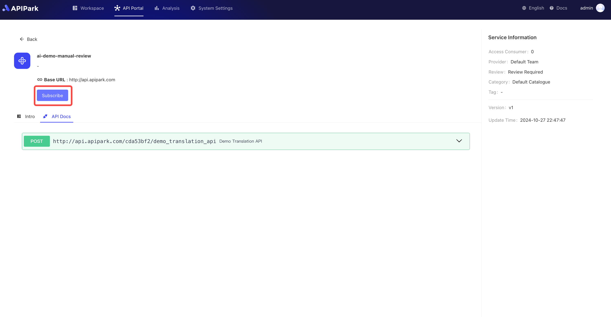

# 消费者

在**APIPark**平台中，**消费者**是指使用平台内API服务的用户。消费者通过申请订阅AI服务或REST服务，获得所需的接口访问权限，并在服务提供方审批通过后，正式调用服务。为确保数据安全和访问权限合规，消费者功能包含完善的鉴权机制，并提供多种便捷的订阅管理工具。

## 功能概述
### 多样化鉴权支持
- **灵活的鉴权方式**：支持多种鉴权方式，包括API Key、Basic、JWT、以及AK/SK等方式，满足不同应用场景的安全需求。
- **动态管理鉴权配置**：消费者可在门户中更新或管理鉴权信息，如定期刷新API Key，或变更JWT配置，以进一步提升数据安全性。

### 服务申请与订阅管理
- **一键申请**：消费者可浏览API门户内展示的AI服务和REST服务，选择符合业务需求的服务并发起订阅申请。
- **快速审批通知**：服务提供方会对申请进行审核，消费者可实时查看审批状态。
- **订阅状态管理**：支持消费者在门户中查看所有已订阅的服务，便于管理调用权限、续订服务、或取消不再需要的服务。

## 操作演示
### 新建消费者

1. 点击`工作空间` -> `消费者` -> `新建消费者`。

  

2. 在弹出框中填写消费者信息，点击`确认`。

  

### 配置鉴权

[🔗 了解更多：配置鉴权](./authorization/README.md)

### 订阅服务

1. 点击`API门户`，选择需要订阅的服务，进入服务详情页。

  

2. 点击`订阅`。

  

3. 在弹出框中选中需要订阅的消费者。

  

填写完描述后，点击`确认`即可。

### 查看已订阅服务
