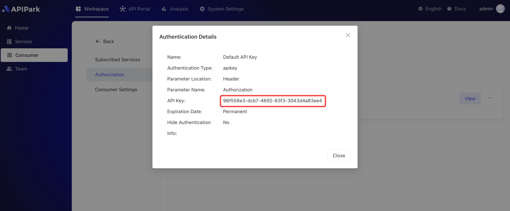

# 调用API

在审批通过后，消费者可以使用已经通过审批的应用信息来调用所订阅服务的API，并获取实际的调用结果。这意味着一旦订阅申请被批准，用户就能够通过应用的访问授权安全地访问和使用服务，执行相关操作，并得到相应的数据或反馈。


:::tip

在调用前，需要满足以下条件

1. 消费者配置了访问授权，若无，请参考教程 [配置访问授权](./authorization/README.md)。
2. 消费者提交了该API所属的服务的订阅申请，若无，请参考教程 [订阅服务](./consumers.md#订阅服务)。
3. 订阅审批通过，若无，请联系服务提供方对申请进行审批，请参考教程 [消费者审核](./services/review_consumers.md#消费者审核)。

:::

假设在 [配置访问授权](./authorization/README.md)操作中，配置的鉴权信息如下：

  


API的调用地址为`http://api.apipark.com/cda53bf2/demo_translation_api`：

  

调用参数为：

  

  

您可以使用以下任意一种方式进行调用服务API。

<details>
<summary>CURL</summary>

选择一台可访问分区网关节点的`服务器/虚拟机/PC`，执行下述命令：

```sh
curl -X POST -H "Authorization: 96f558e3-dcb7-4692-83f3-3043d4a83ee4" \
-H "Content-Type: application/json" -d "{\"messages\":[],\"variables\":{\"source_lang\":\"Chinese\",\"target_lang\":\"English\",\"text\":\"\"}}" \
http://api.apipark.com/cda53bf2/demo_translation_api
```

调用结果如图所示
  


</details>

<details>

<summary>Postman</summary>

填写鉴权信息，如下图

 

填写请求体信息，如下图

  

响应结果如下图：

  
</details> 