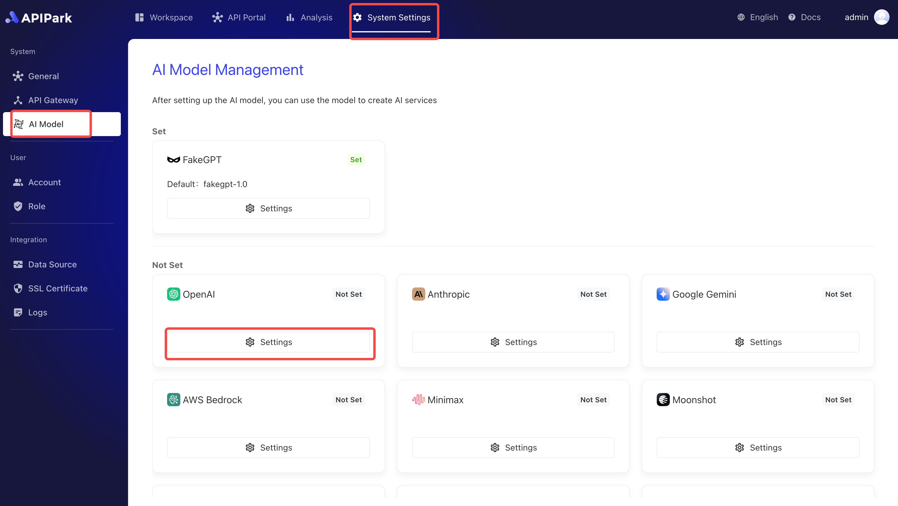

# 接入AI模型

APIPark 的 AI 供应商模块用于管理和配置多个主流 AI 供应商的集成，使用户能够在平台内灵活调用不同的 AI 模型服务。用户通过填写API 密钥等供应商信息，完成供应商的设置后，即可在系统中使用相应的 AI 服务。

目前支持的供应商包括：

* OpenAI
* Anthropic
* Google Gemini
* AWS Bedrock
* Minimax
* Moonshot
* Wenxin YiYan（文心一言）
* 01.AI
* 360 AI
* ... 

这些供应商涵盖了广泛的 AI 服务和模型，用户可以根据业务需求灵活选择。

## 配置 AI供应商（OpenAI示例）

:::tip

在配置`OpenAI`供应商前，请确保您已经完成了`OpenAI`的身份认证，并已经创建完成`OpenAI`的调用`APIKey`。

若未完成，请参考 [OpenAI官方文档](https://platform.openai.com/account/api-keys) 进行申请。

OpenAI无法在中国大陆申请账号并调用，且申请APIKey需要绑定支付信息（Visa卡）。可自行搜索相关教程进行获取，本教程不予赘述。

在操作前，需要确定配置完成API网关集群，若未配置好，请查阅[配置网关集群](../system_setting/api_gateway_cluster.md)
:::

1. 点击`系统设置` -> `AI 模型`，进入AI供应商列表页面，点击 `Open AI` 下方的设置按钮。

  

2. 选择供应商默认生效模型。

:::tip
在创建AI服务时，需要选择供应商，当AI服务创建成功后，系统会为当前AI服务自动创建一个默认API，该API使用的模型为当前步骤设置的供应商默认模型。
:::

  

3. 填写供应商信息。

  

**字段描述**

| 名称            | 含义                                                         |
| --------------- | ------------------------------------------------------------ |
| openai_api_key  | 供应商APIKey，请参考 [OpenAI官方文档](https://platform.openai.com/account/api-keys) 进行申请 |
| openai_api_base | OpenAI代理地址，由于中国国内不支持访问，因此需要通过代理才可连接OpenAI，目前免费的代理地址有 * https://api.openai-proxy.com |

4. 填写完成后点击保存即可。
