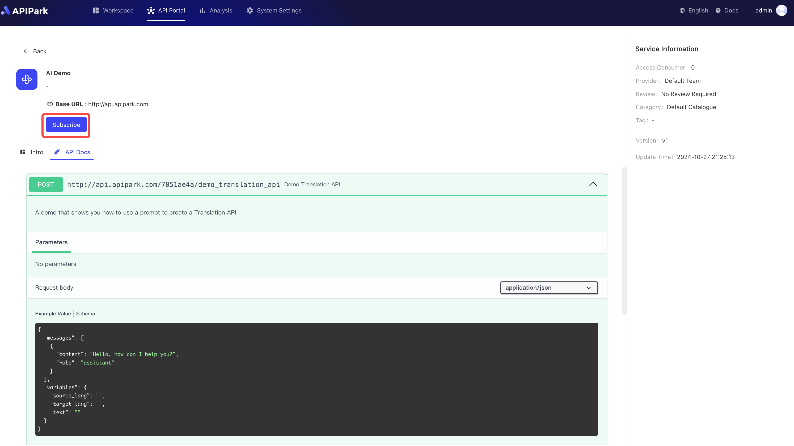
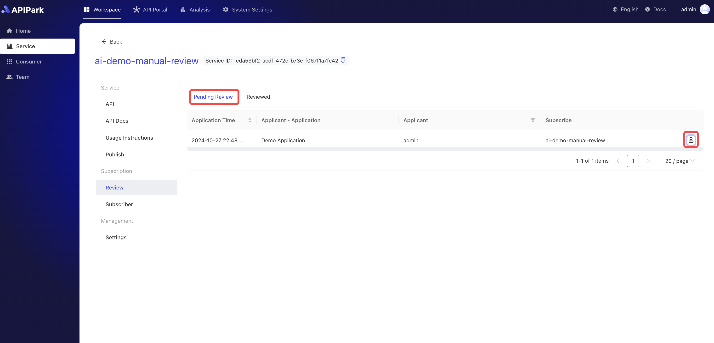
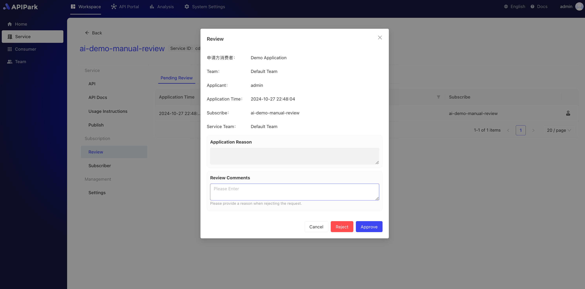

# 消费者审核

在服务发布后，所有的**REST服务**和**AI服务**将集中展示于API门户中，便于消费者浏览和选择。消费者可以通过门户查看各服务的详细信息，包括功能说明、接口文档、调用示例等，以便根据业务需求选择最合适的服务并发起订阅申请。

在提交订阅申请后，系统会将申请信息推送至服务提供方进行审核。审核通过后，消费者将收到订阅成功的通知，并正式获得对相应API接口的访问权限。在审核期间，消费者可以查看申请状态，确保服务接入过程的透明性和高效性。

具体流程如下：

**服务展示**：API门户集中展示各类REST和AI服务，提供搜索、筛选及分类功能，便于消费者快速定位所需服务。服务详情页展示关键信息，如功能介绍、使用案例、API文档、可选数据格式等。

  

  

**订阅申请**：消费者在选定服务后，可在线提交订阅申请，填写所需的使用用途、调用预期等信息，以便服务提供方进行评估。在订阅前，

  

  

**审核流程**：服务提供方会接收到订阅申请，并根据申请信息对消费者资质和使用目的进行审核。此流程有助于保障服务的安全性和适用性。

若服务新建时，选择无需审核选项，则消费者申请订阅后，将会自动通过申请，无需服务提供商进行审核，如下：

  

  

若服务新建时，选择手动审核选项，则消费者提交申请后，需要服务提供方对申请进行审核，通过后消费者才可对服务进行调用，如下：
  

  

  
