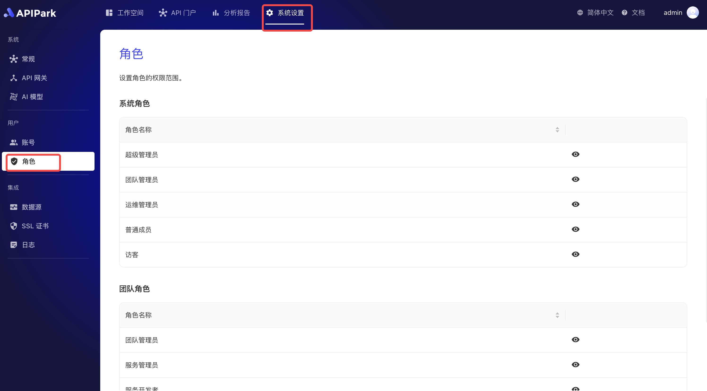
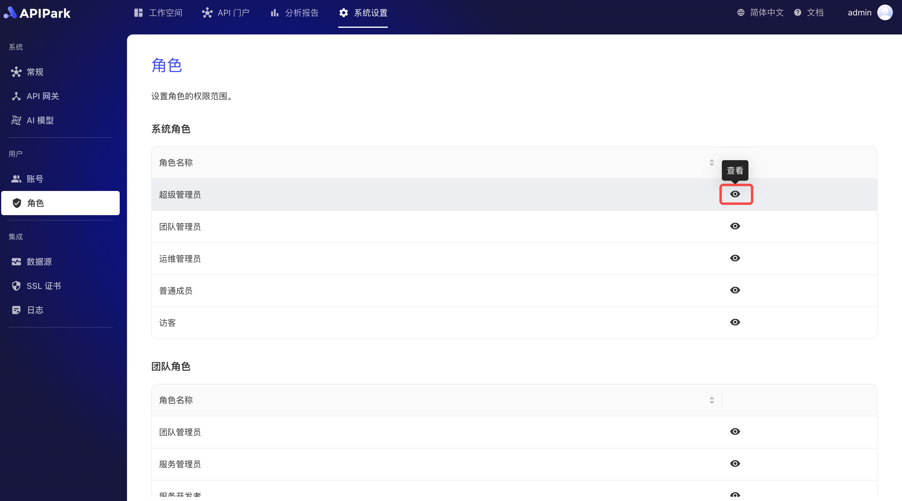
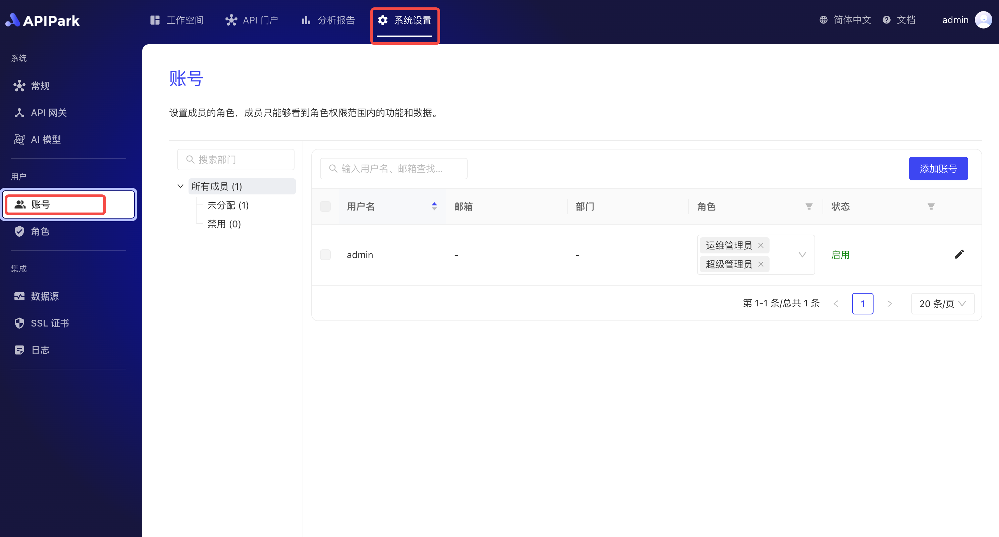

# 用户角色

APIPark 的用户角色模块用于管理系统内不同角色的权限设置，确保用户在其职责范围内拥有适当的访问和操作权限。该模块将角色分为 **系统角色** 和 **团队角色** 两大类，分别适用于平台级别和团队级别的权限控制。

- **系统角色** ：包括超级管理员、团队管理员、普通成员等，主要用于系统预设的通用角色。
- **团队角色** ：如团队管理员、服务开发者、应用管理员等，用于团队内部成员的灵活权限分配。

每个角色可设置详细的权限，包括 **组织管理**（成员、团队、角色的查看和管理）、**系统设置**（服务目录、集群、SSL 证书、数据源、日志配置、AI 供应商等模块的访问权限）。通过该模块，系统管理员能够精细化控制各类用户的访问权限，提升系统的安全性和管理效率。

## 角色权限一览
### 系统级别权限

<table>
  <tr>
    <th></th>
    <th></th>
    <th></th>
    <th>最高管理员（无法删改）</th>
    <th>团队管理员</th>
    <th>运维管理员</th>
    <th>[默认] 普通成员</th>
  </tr>
  <tr>
    <th rowspan="6">组织</th>
    <td rowspan="2">成员</td>
    <td>查看</td>
    <td>✔</td>
    <td></td>
    <td></td>
    <td></td>
  </tr>
  <tr>
    <td>管理</td>
    <td>✔</td>
    <td></td>
    <td></td>
    <td></td>
  </tr>
  <tr>
    <td rowspan="2">团队</td>
    <td>查看</td>
    <td>✔</td>
    <td>✔</td>
    <td></td>
    <td></td>
  </tr>
  <tr>
    <td>管理</td>
    <td>✔</td>
    <td>✔</td>
    <td></td>
    <td></td>
  </tr>
  <tr>
    <td rowspan="2">角色</td>
    <td>查看系统角色</td>
    <td>✔</td>
    <td></td>
    <td></td>
    <td></td>
  </tr>
  <tr>
    <td>查看团队角色</td>
    <td>✔</td>
    <td>✔</td>
    <td></td>
    <td></td>
  </tr>
  <tr>
    <th rowspan="2">API门户</th>
    <td rowspan="2">服务分类</td>
    <td>查看</td>
    <td>✔</td>
    <td></td>
    <td>✔</td>
    <td></td>
  </tr>
  <tr>
    <td>管理</td>
    <td>✔</td>
    <td>✔</td>
    <td></td>
    <td></td>
  </tr>
  <tr>
    <th rowspan="8">运维</th>
    <td rowspan="2">集群</td>
    <td>查看</td>
    <td>✔</td>
    <td></td>
    <td>✔</td>
    <td></td>
  </tr>
  <tr>
    <td>管理</td>
    <td>✔</td>
    <td></td>
    <td>✔</td>
    <td></td>
  </tr>
  <tr>
    <td rowspan="2">SSL证书</td>
    <td>查看</td>
    <td>✔</td>
    <td></td>
    <td>✔</td>
    <td></td>
  </tr>
  <tr>
    <td>管理</td>
    <td>✔</td>
    <td></td>
    <td>✔</td>
    <td></td>
  </tr>
  <tr>
    <td rowspan="2">日志</td>
    <td>查看</td>
    <td>✔</td>
    <td></td>
    <td>✔</td>
    <td></td>
  </tr>
  <tr>
    <td>管理</td>
    <td>✔</td>
    <td></td>
    <td>✔</td>
    <td></td>
  </tr>
  <tr>
    <td rowspan="2">OpenAPI</td>
    <td>查看</td>
    <td>✔</td>
    <td></td>
    <td>✔</td>
    <td></td>
  </tr>
  <tr>
    <td>管理</td>
    <td>✔</td>
    <td></td>
    <td>✔</td>
    <td></td>
  </tr>
  <tr>
    <td rowspan="2">仪表盘</td>
    <td>运行视图</td>
    <td>查看</td>
    <td>✔</td>
    <td></td>
    <td>✔</td>
    <td></td>
  </tr>
  <tr>
    <td>系统拓扑图</td>
    <td>查看</td>
    <td>✔</td>
    <td></td>
    <td>✔</td>
    <td></td>
  </tr>
  <tr>
    <th rowspan="4">工作空间</th>
    <td>应用</td>
    <td>查看所有应用（若不勾选，则只查看已加入的）</td>
    <td>✔</td>
    <td>✔</td>
    <td>✔</td>
    <td></td>
  </tr>
  <tr>
    <td>服务</td>
    <td>查看所有服务（若不勾选，则只查看已加入的）</td>
    <td>✔</td>
    <td>✔</td>
    <td>✔</td>
    <td></td>
  </tr>
  <tr>
    <td>团队</td>
    <td>查看所有团队（若不勾选，则只查看已加入的）</td>
    <td>✔</td>
    <td>✔</td>
    <td>✔</td>
    <td></td>
  </tr>
  <tr>
    <td>API门户</td>
    <td>查看</td>
    <td>✔</td>
    <td>✔</td>
    <td>✔</td>
    <td>✔</td>
  </tr>
</table>

### 团队级别权限

<table>
  <tr>
    <th></th>
    <th></th>
    <th></th>
    <th>团队管理员</th>
    <th>服务管理员</th>
    <th>服务开发者</th>
    <th>应用管理员</th>
    <th>[默认] 应用开发者</th>
  </tr>
  <tr>
    <th rowspan="10">服务</th>
    <td rowspan="2">API</td>
    <td>查看</td>
    <td>✔</td>
    <td>✔</td>
    <td>✔</td>
    <td></td>
    <td></td>
  </tr>
  <tr>
    <td>管理</td>
    <td>✔</td>
    <td>✔</td>
    <td>✔</td>
    <td></td>
    <td></td>
  </tr>
  <tr>
    <td rowspan="2">上游</td>
    <td>查看</td>
    <td>✔</td>
    <td>✔</td>
    <td>✔</td>
    <td></td>
    <td></td>
  </tr>
  <tr>
    <td>管理</td>
    <td>✔</td>
    <td>✔</td>
    <td>✔</td>
    <td></td>
    <td></td>
  </tr>
  <tr>
    <td rowspan="2">发布</td>
    <td>查看</td>
    <td>✔</td>
    <td>✔</td>
    <td>✔</td>
    <td></td>
    <td></td>
  </tr>
  <tr>
    <td>管理</td>
    <td>✔</td>
    <td>✔</td>
    <td>✔</td>
    <td></td>
    <td></td>
  </tr>
  <tr>
    <td rowspan="2">订阅方管理（包括订阅方审批和订阅方列表）</td>
    <td>查看</td>
    <td>✔</td>
    <td>✔</td>
    <td></td>
    <td></td>
    <td></td>
  </tr>
  <tr>
    <td>管理</td>
    <td>✔</td>
    <td>✔</td>
    <td></td>
    <td></td>
    <td></td>
  </tr>
  <tr>
    <td>服务管理</td>
    <td>管理（新增、修改、删除服务）</td>
    <td>✔</td>
    <td>✔</td>
    <td></td>
    <td></td>
    <td></td>
  </tr>
  <tr></tr>
  <tr>
    <th rowspan="6">应用</th>
    <td rowspan="2">订阅服务</td>
    <td>查看</td>
    <td>✔</td>
    <td></td>
    <td></td>
    <td>✔</td>
    <td>✔</td>
  </tr>
  <tr>
    <td>管理</td>
    <td>✔</td>
    <td></td>
    <td></td>
    <td>✔</td>
    <td>✔</td>
  </tr>
  <tr>
    <td rowspan="2">访问授权</td>
    <td>查看</td>
    <td>✔</td>
    <td></td>
    <td></td>
    <td>✔</td>
    <td>✔</td>
  </tr>
  <tr>
    <td>管理</td>
    <td>✔</td>
    <td></td>
    <td></td>
    <td>✔</td>
    <td></td>
  </tr>
  <tr>
    <td rowspan="2">应用管理</td>
    <td>管理（新增、修改、删除应用）</td>
    <td>✔</td>
    <td></td>
    <td></td>
    <td>✔</td>
    <td></td>
  </tr>
  <tr></tr>
  <tr>
    <th rowspan="4">团队</th>
    <td rowspan="2">成员</td>
    <td>查看</td>
    <td>✔</td>
    <td>✔</td>
    <td>✔</td>
    <td>✔</td>
    <td>✔</td>
  </tr>
  <tr>
    <td>管理</td>
    <td>✔</td>
    <td></td>
    <td></td>
    <td></td>
    <td></td>
    <td></td>
  </tr>
  <tr>
    <td rowspan="2">团队管理</td>
    <td>查看</td>
    <td>✔</td>
    <td></td>
    <td></td>
    <td></td>
    <td></td>
  </tr>
  <tr>
    <td>管理（修改、删除团队）</td>
    <td>✔</td>
    <td></td>
    <td></td>
    <td></td>
    <td></td>
    <td></td>
  </tr>
</table>
## 查看角色权限

1. 点击`系统设置` -> `角色`，进入系统角色列表。

 

2. 点击后方的`查看`，进入角色权限详情页。

  

  

## 分配系统角色
1. 点击`系统设置` -> `账号`，进入账号列表页面

  

2. 在角色下拉框中选择需要分配的系统角色。

  

## 分配团队角色
1. 点击`工作空间` -> `团队`，进入团队列表页面。

  

2. 选择需要分配角色的团队，进入团队内页，点击`账号`。

  

3. 在角色下拉框选择需要分配的团队角色。

  
