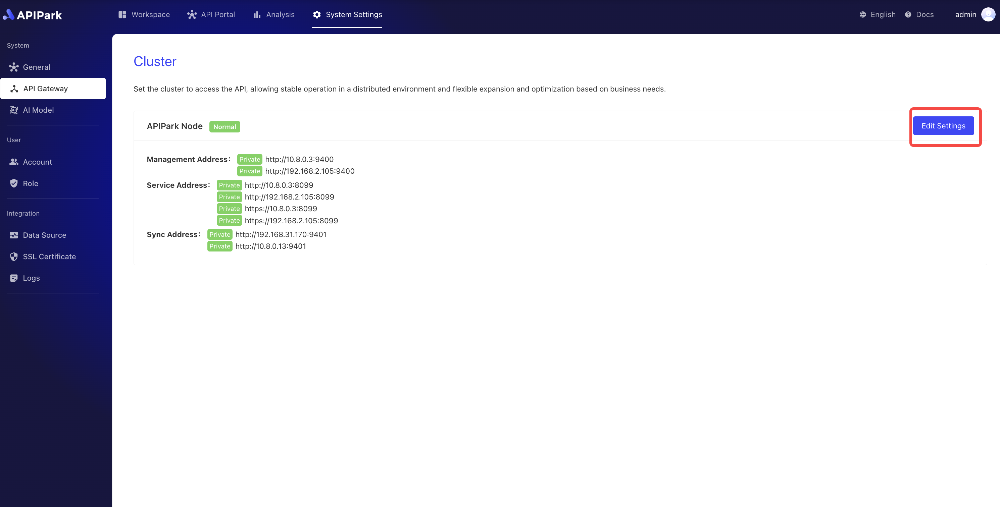
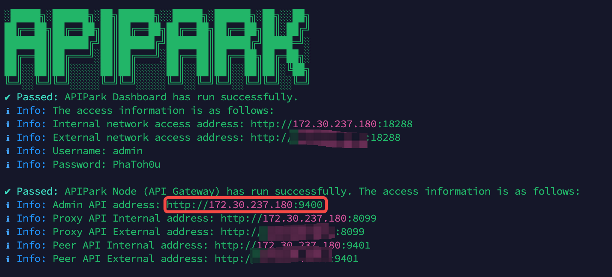

# API网关集群

**API网关集群**是**APIPark**的一个核心组件，它承担了API流量管理、安全控制和流量优化等多项重要任务。对于**APIPark**来说，API网关集群提供了关键的支持，使得API的调用和管理更加安全、可靠且高效。

API网关集群在**APIPark**中的作用体现在以下几个方面：

* **增强API安全性与控制**：通过网关集群的鉴权和安全策略，开发者门户内的API得以更安全、合规地开放给消费者，降低安全风险，使服务接入更安全。

* **提供稳定的高性能支持**：网关集群的负载均衡和自动扩展能力帮助开发者门户应对高并发流量，保障API调用的响应速度，优化消费者体验。

* **简化调用限制与权限管理**：网关集群根据消费者订阅内容设置速率限制和流量控制，开发者门户因此能够灵活定义不同级别的访问权限，使API使用更高效并防止滥用。

* **实时调用监控与分析**：开发者门户借助网关集群的监控和日志功能，可为消费者提供详细的调用统计和使用分析，便于消费者优化API调用策略。

* **提高集成便捷性**：通过网关集群的智能路由和数据转换功能，开发者门户中的API接口能够自动适配不同消费者的系统需求，提升集成效率，降低开发者的对接难度。

API网关集群是**APIPark**的后台支撑，保障了API的安全、稳定和高效调用。它不仅为API调用流程提供了全面的安全控制和性能优化，还通过监控与管理功能，使开发者门户能够更好地服务消费者，为API生态系统的可持续发展提供了坚实的技术保障。

## 配置网关集群

:::tip
配置前确保已经部署完成**APIPark**网关节点，若无，请参考教程[部署APIPark网关节点](../quick/deploy.md)
:::
1. 点击`系统配置` -> `API网关`，点击`修改设置`。

  

2. 在弹出框中输入集群节点Admin地址。
:::tip
若您使用一键部署脚本部署APIPark网关节点，在部署完成后会显示节点的Admin通信地址。

  
:::

3. 填写完后，点击`下一步`。

  

4. 测试通过后，点击确认。

  