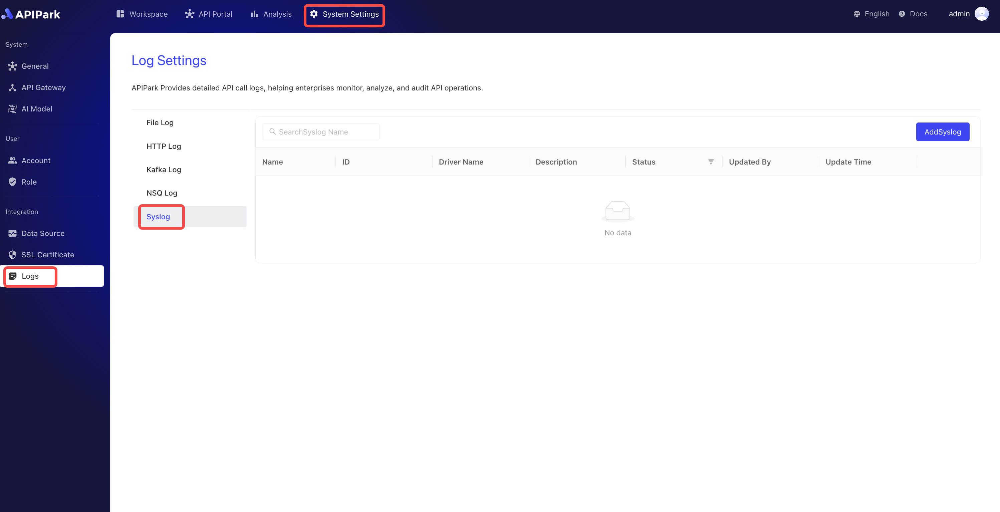

# Syslog日志

## 简介

收集请求网关的日志信息，并将其输出到`Syslog`中。

## 特性

能够将程序运行中产生的日志内容输出远端的Syslog服务器。

* 支持多种请求协议，包括TCP、UDP、UNIX
* 支持设置Syslog输出日志等级
* 支持日志输出格式类型
* 支持自定义日志格式化配置

## 操作演示

### 新建Syslog日志配置

1. 点击`运维与集成` -> `Syslog日志`，点击`添加Syslog日志`。

  


2. 填写Syslog日志配置，填写完成后点击`确认`。

  


**配置说明**：

| 字段名称   | 说明                                                         |
| ---------- | ------------------------------------------------------------ |
| 网络协议   | 请求Syslog服务的协议，支持TCP、UDP、UNIX                     |
| 服务器地址 | Syslog服务的地址                                             |
| 日志等级   | Syslog输出日志等级，支持ERROR、WARN、INFO、DEBUG、TRACE      |
| 输出格式   | 输出日志内容格式，支持单行、Json格式输出                     |
| 格式化配置 | 输出格式模版，配置教程[点此](https://help.apinto.com/docs/formatter)进行跳转 |

**格式化配置示例**

```json
{
   "fields": [
      "$time_iso8601",
      "$request_id",
      "@request",
      "@proxy",
      "@response",
      "@status_code",
      "@time"
   ],
   "request": [
      "$request_method",
      "$scheme",
      "$request_uri",
      "$host",
      "$header",
      "$remote_addr"
   ],
   "proxy": [
      "$proxy_method",
      "$proxy_scheme",
      "$proxy_uri",
      "$proxy_host",
      "$proxy_header",
      "$proxy_addr"
   ],
   "response": [
      "$response_headers"
   ],
   "status_code": [
      "$status",
      "$proxy_status"
   ],
   "time": [
      "$request_time",
      "$response_time"
   ]
}
```

### 上线

1. 点击待上线配置后方的`上线`按钮。

  

