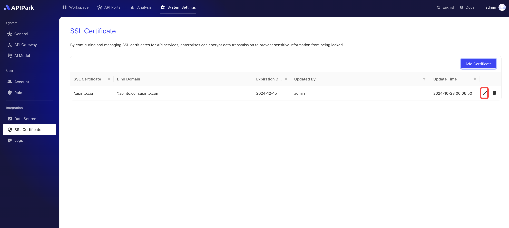

# SSL证书

**APIPark**提供管理**API网关SSL证书**的功能，确保消费者在访问API服务时可以通过**HTTPS协议**进行安全加密的通信。通过集中管理SSL证书，平台实现了便捷的证书维护和更新，提升了API服务的安全性和信任度。

* **集中管理SSL证书**：**APIPark**支持对API网关SSL证书的统一管理，包括证书的添加、更新、续订和删除操作，简化了运维流程，确保API网关始终具备有效的SSL证书。

* **安全加密的HTTPS访问**：消费者在调用API服务时，通过HTTPS协议与API网关建立安全连接，所有数据传输均经过加密处理，防止数据泄露或篡改，提升了敏感数据的安全性。

* **自动化证书更新和到期提醒**：**APIPark**提供证书到期提醒功能，并支持自动更新，避免因证书过期导致的服务中断或安全风险，保障API网关始终具备最新的SSL证书。

* **增强消费者信任**：通过HTTPS的安全标识，消费者可以确认API服务的合法性和安全性，增加对平台的信任度，有助于提高服务的用户体验和专业性。

* **跨环境的SSL兼容**：**APIPark**支持对不同环境（如开发、测试、生产环境）的SSL证书管理，确保各环境下的API网关均可以提供HTTPS安全访问，便于灵活的环境管理和快速部署。

通过这些SSL证书管理功能，**APIPark**有效提升了API服务的安全性、运维效率和用户体验，为消费者提供了安全可靠的API访问保障。

### 添加证书
:::tip
在添加证书前，需要先有可用的API网关集群，若无，请参考教程[配置API网关集群](./api_gateway_cluster.md)。
:::
1. 点击`系统管理` -> `SSL证书`，进入证书列表页面。

  

2. 点击`添加证书`。

  

3. 在弹出框中上传密钥（`.key`）和证书（`.pem`或`.csr`）文件

  

上传完后，点击`确认`即可。

### 修改证书
1. 点击待修改证书后方的`编辑`按钮。

  

2. 在弹出框中上传密钥（`.key`）和证书（`.pem`或`.csr`）文件。

  

上传完后，点击`确认`即可。

### 删除证书

点击待修改证书后方的`删除`按钮。

  
