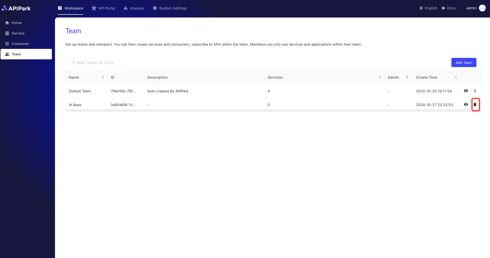

# 团队协作

APIPark 中的团队模块是一个高效的协作工具，旨在按团队创建和管理服务。通过团队模块，企业可以根据项目需求组建不同的团队，每个团队可以独立管理其 API 服务。团队模块包含一个成员模块，用于管理加入团队的成员。

## 团队管理

### 新建团队

1. 点击`工作空间` -> `团队` -> `新建团队`。

  

2. 在弹出框中输入团队信息，填写完后点击`确认`。

  

**字段说明**

<table><thead><tr><th width="203">字段名</th><th>说明</th></tr></thead><tbody><tr><td>团队名称</td><td>用于标识和区分不同团队的标识符。团队名称应简洁明了，能够准确反映团队的职责和任务。</td></tr><tr><td>团队ID</td><td>团队唯一标识符，可自定义。</td></tr><tr><td>团队负责人</td><td>指定团队负责人，创建团队后，该负责人将会获得团队管理员的团队角色</td></tr><tr><td>描述</td><td>记录和展示与特定团队相关的详细信息和备注。</td></tr></tbody></table>

### 编辑团队配置

1. 点击待编辑的团队，进入团队设置界面。

  

2. 编辑团队信息，编辑完后点击保存。

  

### 删除团队
:::tip
删除团队提供两个入口，若团队含有服务，则该团队不允许删除。
:::
1. 在团队列表中点击删除

  

2. 在团队设置页面中点击删除

  

## 团队成员

在成员模块中，管理者可以轻松添加或移除团队成员，并为每个成员分配适当的权限，确保他们只能访问和操作他们被授权的部分。

权限设置功能使得团队管理更加灵活和安全，可以根据不同角色分配不同的访问级别，如管理员、开发者、查看者等。这不仅提高了工作的透明度和效率，还确保了敏感信息的安全管理。

:::tip
添加进团队的成员默认获得 `应用开发者` 的团队角色。
:::

1. 点击需要添加成员的团队，进入团队内页。

  

2. 点击`账号`导航栏，点击`添加成员`按钮。

  

3. 在弹出框中选择需要添加到团队中的成员，并把它移动到右边。

操作完成后，点击确定即可。
