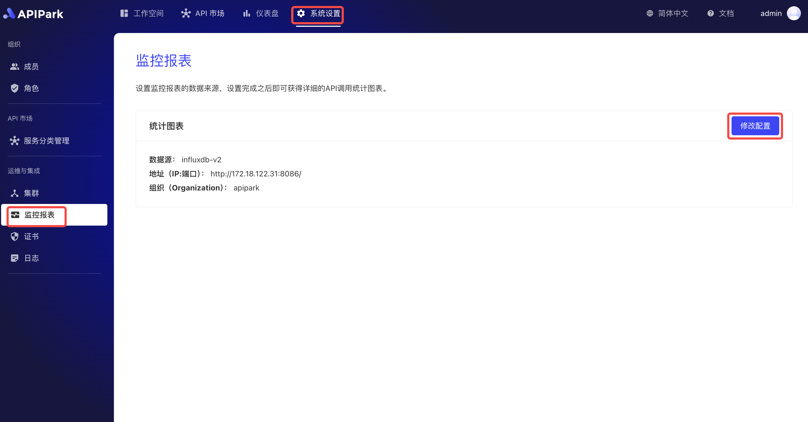
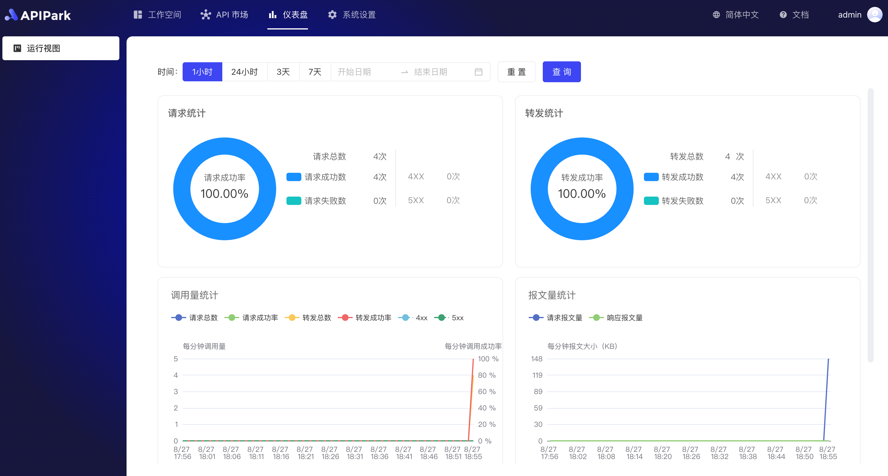

# 配置监控

## 操作演示
:::tip
在进行配置前，您需要配置安装并配置好InfluxDB数据库，若无，请参考教程[配置InfluxDB](../../install.md#配置InfluxDB)
:::

1. 点击`系统设置` -> `运维与集成` -> `监控报表`，进入监控配置界面，点击后方的`修改配置`。

  

2. 输入InfluxDB配置信息，填写完成后，点击`保存`。

  

## 运行视图
:::tip
配置完监控后，我们可以到仪表盘中查看API的运行情况。仪表盘中提供了多种统计图表，帮助我们了解 API 的运行情况。
:::

  

  
