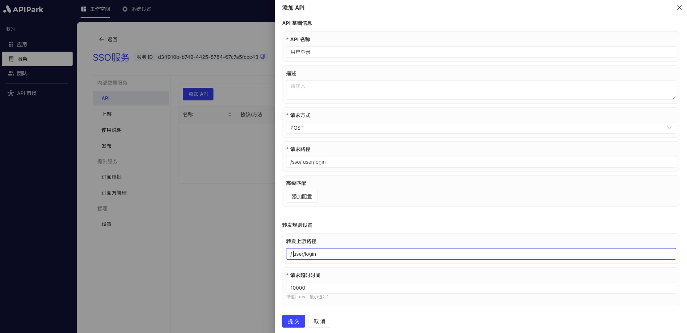
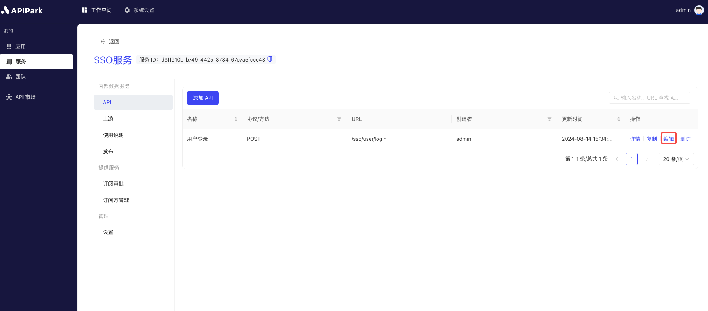

# 添加API

API 是`APIPark`的核心组成部分，通过标准化的接口，连接各类服务和应用，实现数据共享和功能调用。API 提供了高效、安全、可扩展的通信机制，支持微服务架构，提升用户体验，促进创新和开发。

在**APIPark**中，API 不仅是系统之间的桥梁，更是构建高效、灵活、创新生态系统的基础。通过良好的 API 设计和管理，平台可以实现高度的互操作性和可扩展性，为用户和开发者提供卓越的服务体验。

## 操作演示

### 添加API

1. 选中需要配置的服务，进入服务内部页面。

2. 点击`添加API`。

  

3. 在弹出框中输入API信息，填写完成后点击`提交`。

  

**字段说明**

<table><thead><tr><th width="195">字段名</th><th>说明</th></tr></thead><tbody><tr><td>API名称</td><td>用于标识API的名称，可按作用、功能命名。</td></tr><tr><td>描述</td><td>记录API的详细说明。</td></tr><tr><td>请求方式</td><td>客户端请求的请求方式。</td></tr><tr><td>请求路径</td><td>客户端请求的请求路径，该路径将会和服务前缀进行拼接。</td></tr><tr><td>高级匹配</td><td>可针对客户端请求定制更多的路由匹配规则。</td></tr><tr><td>转发上游路径</td><td>转发到上游的路径，可与请求路径不一致。</td></tr><tr><td>请求超时时间</td><td>转发请求到上游服务的超时时间，单位：ms。</td></tr><tr><td>重试次数</td><td>当请求超时时，重新转发请求的次数。</td></tr></tbody></table>

4. 点击待编辑API后方的`编辑`按钮。

 

5. 填写API文档信息，内容包括请求参数、返回值等客户端请求所需要传递的参数信息。

  

此处的文档内容将会展示在服务广场中，供服务订阅方去了解如何调用订阅的API。

### 