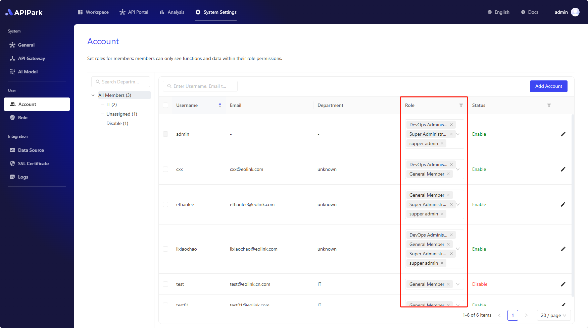

# 账号与角色

APIPark 基于 RBAC 模式来设计用户系统，系统管理员可以为每个成员创建账号并设置账号的角色。

APIPark 的用户角色分为 **系统级别角色** 和 **团队级别角色**：

- **系统级别角色** ：全局生效的用户角色，控制用户在 APIPark 系统级别的功能权限，比如管理 APIPark 内所有的成员，设置 API 网关集群，设置全局日志和数据源等。
- **团队级别角色** ：仅在团队内生效的用户角色，控制用户在如团队内的功能权限，比如管理团队内的成员、在团队内创建服务和消费者等。

> 💡 **社区版** 内置了基本的角色，便于用户直接给用户分配角色和权限。**商业版** 可设置每个角色详细的权限，满足企业复杂的安全要求，你可以联系 APIPark 的销售人员了解更多信息。

## 创建账号

进入 **系统设置** 模块，在侧边栏选择 **账号**，点击 **创建账号**，在弹窗中输入：

- **用户名称**：用于登录 APIPark。
- **邮箱**：用户接收 APIPark 的系统通知消息。
- **部门**：如果不选择部门，会自动设置为 **未分配**。

> 💡 新账号的初始密码为 **12345678**，为了避免数据泄露，请及时修改账号密码。

## 为账号设置系统级别角色

进入 **系统设置** 模块，在侧边栏选择 **账号**，在账号列表中可以对用户设置多个系统级别角色。

## 为账户设置团队级别角色

你可以在 APIPark 里创建多个团队，团队类似于租户的概念，每个团队拥有各自的成员、服务、消费者。你可以通过团队功能来管理复杂的组织结构。

你需要先创建团队，并且将成员加入团队后，才能设置成员在该团队的角色。

如需创建团队，请查看：[🔗 创建团队](../teams.md)