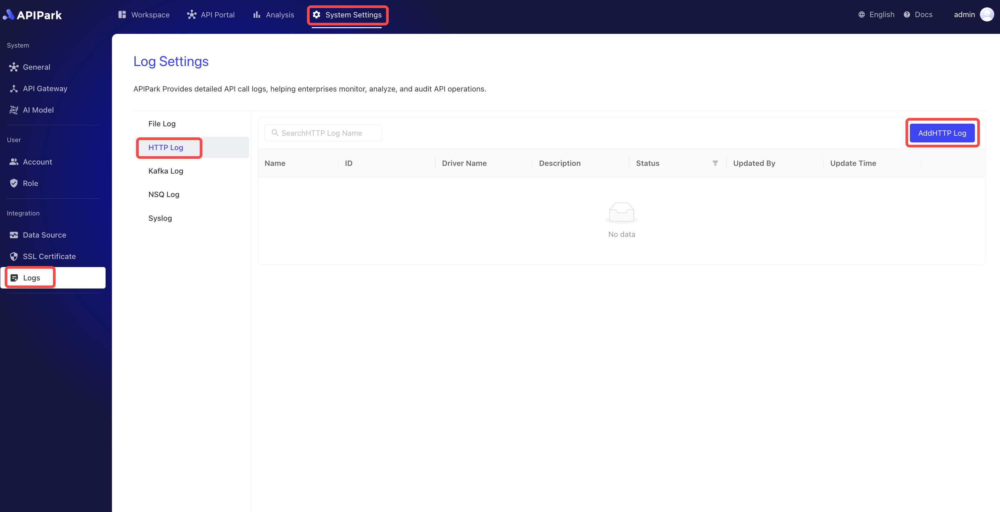
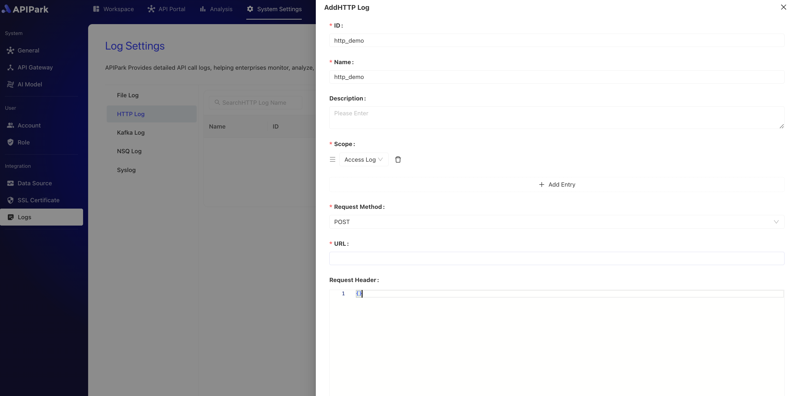

# HTTP日志

收集请求网关的日志信息，并将其输出到**HTTP服务器**中，方便使用者进行二次操作，如日志分析等。

## 特性

HTTP日志插件通过HTTP请求的方式，将节点访问日志发送给HTTP服务接口中，并且具备以下特性：

* 支持多种请求方式，包括**POST**、**PUT**、**PATCH**
* 支持自定义请求头部
* 支持日志输出格式类型
* 支持自定义日志格式化配置

## 操作演示

### 新建HTTP日志配置

1. 点击`系统设置` -> `日志` -> `HTTP日志`，点击`添加HTTP日志`。

  

2. 填写HTTP日志配置，填写完成后点击`确认`。

  

**配置说明**：

| 字段名称   | 说明                                                         |
| ---------- | ------------------------------------------------------------ |
| 请求方式   | 请求HTTP服务接口时使用的请求方式，目前支持POST、PUT、PATCH   |
| URL        | HTTP服务接口的完整请求路径                                   |
| 请求头部   | 请求的头部信息，可以填请求HTTP服务接口时需要提供的参数,如鉴权等信息<br/>填写时，需要填写JSON格式数据，数据为`key-value`格式，如：`{"from":"apinto"}` |
| 输出格式   | 输出日志内容格式，支持单行、Json格式输出                     |
| 格式化配置 | 输出格式模版，配置教程[点此](https://help.apinto.com/docs/formatter)进行跳转 |

**格式化配置示例**

```json
{
   "fields": [
      "$time_iso8601",
      "$request_id",
      "@request",
      "@proxy",
      "@response",
      "@status_code",
      "@time"
   ],
   "request": [
      "$request_method",
      "$scheme",
      "$request_uri",
      "$host",
      "$header",
      "$remote_addr"
   ],
   "proxy": [
      "$proxy_method",
      "$proxy_scheme",
      "$proxy_uri",
      "$proxy_host",
      "$proxy_header",
      "$proxy_addr"
   ],
   "response": [
      "$response_headers"
   ],
   "status_code": [
      "$status",
      "$proxy_status"
   ],
   "time": [
      "$request_time",
      "$response_time"
   ]
}
```

### 上线

1. 点击待上线配置后方的`上线`按钮。

  
