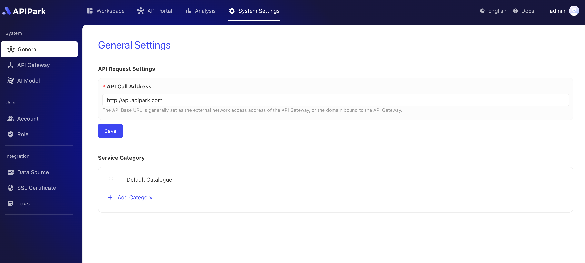
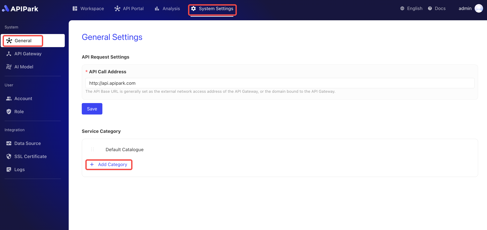

# 常规设置

该模块可配置APIPark的常规配置，包括展示在API门户的API调用地址、服务绑定的服务分类信息等。

## 配置API请求地址

在 API Park 平台上，**API 请求地址**设置用于指定接口调用的基础 URL（Base URL），这为 API 请求的完整路径提供了前缀。在系统设置中配置了 API 请求地址后，平台会自动将其作为前缀应用到 API 文档的展示和实际请求路径中，确保统一的地址格式，提升了管理和调用的便捷性。

### 主要功能逻辑

1. **设置基础 URL**：管理员在系统设置的“通用设置”中，可以配置 `API 请求地址`，如 `http://api.apipark.com`。这是平台 API 的基础路径，所有 API 调用的前缀地址。
2. **文档展示**：在 API 门户中，当用户查看 API 文档时，设置的基础 URL 将自动显示在 API 地址前。例如，某个翻译 API 的路径 `/demo_translation_api` 会展示为 `http://api.apipark.com/demo_translation_api`。
3. **调用路径统一**：通过在系统中设定统一的 `API 请求地址`，用户在调用 API 时无需手动拼接基础路径，只需关注具体的 API 资源路径，减少了调用中的错误和配置难度。
4. **动态更新**：如果 `API 请求地址` 发生更改，所有在文档中展示的 API 路径将自动更新，保持文档与实际调用地址的一致性，确保系统的灵活性与易维护性。

### 应用场景

- **统一管理**：适用于需要统一管理 API 请求地址的场景，确保所有 API 服务在同一域名或基础路径下发布，便于维护和安全控制。
- **多环境支持**：在不同环境（如开发、测试、生产）下，可以使用不同的 `API 请求地址`，而无需修改各个 API 的路径配置。

### 操作步骤

1. 点击 `系统设置` -> `常规`，进入常规设置页面

  

2. 输入API调用地址，格式为 `http/https`+`://` + `{ip}`/`域名` + `端口号`，填写完成后，点击`保存`。

  

配置完成后，API调用地址将会自动填充到文档中，如下图：

  

## 服务分类

在 API Park 平台中，**服务分类模块**用于对不同类型的服务进行分类和管理。创建服务（包括 REST 服务和 AI 服务）时，系统要求绑定一个服务分类，方便在 API 门户中按分类筛选和浏览服务。该模块不仅提升了服务管理的条理性，还帮助用户在 API 门户中快速找到所需的服务。

### 主要功能

1. **分类绑定**：每个新建服务必须绑定一个服务分类。这样，无论是 REST 服务还是 AI 服务，都可以按其功能或应用场景进行组织，方便管理和使用。
2. **服务筛选**：在 API 门户中，用户可以基于服务分类筛选服务列表。通过分类快速定位服务，提升了用户查找的效率，尤其适用于服务数量多的情况下。
3. **子分类支持**：服务分类模块支持创建子分类，便于更细致的分类管理。例如，可以为 “AI 服务” 分类下设立不同领域的子分类（如自然语言处理、计算机视觉等），从而帮助用户更精准地查找特定服务。
4. **排序功能**：分类和子分类支持排序功能，管理员可以根据优先级或使用频率调整分类的展示顺序，使重要或常用的分类更加突出。

### 应用场景

- **清晰的分类管理**：通过对服务进行分层管理和展示，便于开发者、测试人员、以及业务人员快速找到所需的服务。
- **提升用户体验**：在 API 门户中，服务分类帮助用户按需筛选和查找所需服务，尤其在服务量大、应用广的场景中尤为有效。

服务分类模块在 API Park 平台中扮演了重要的组织和导航角色。通过分类绑定、筛选、子分类、排序等功能，为服务的管理、使用和查找提供了高效的解决方案，大幅优化了用户体验和系统的可维护性。

### 操作步骤

#### 新建分类
1. 点击`系统设置` -> `常规`，进入常规设置页面，点击`新建分类`。
  

2. 在弹出框中填写分类名称，点击`确认`即可。
  

#### 新建子分类
1. 点击分类后方的菜单按钮，在弹出框中选择`新建子分类`。
  

2. 在弹出框中填写子分类名称，点击`确认`即可。
  

#### 分类排序
1. 点击分类前方的排序按钮，如下图
  

2. 拖动分类，直到排序准确，如下图
  

  
