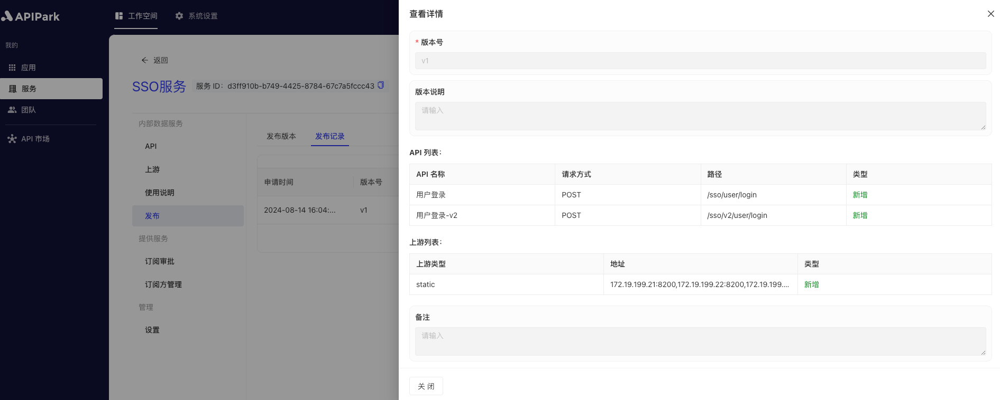

# 发布

发布服务版本是将最新配置的服务和 API 部署到生产环境的重要步骤，确保订阅者调用时可以访问到最新发布版本的 API。通过发布服务版本，可以统一管理 API 和服务的生命周期，确保服务和 API 的最新配置能够及时生效，保证系统的稳定性和可靠性。

执行发布操作后，若当前服务为`外部服务`，则该服务将会展示在服务广场中。

## 操作演示
### 发布版本

1. 选中需要配置的服务，进入服务内部页面。

2. 点击`发布`，点击`新建版本`。

  

3. 在弹出框中输入版本说明信息，填写完后，点击`确认`。

  

### 查看发布记录

1. 点击`发布记录`，进入记录列表页面。

  

2. 点击记录后方的`查看详情`按钮。

  

  
