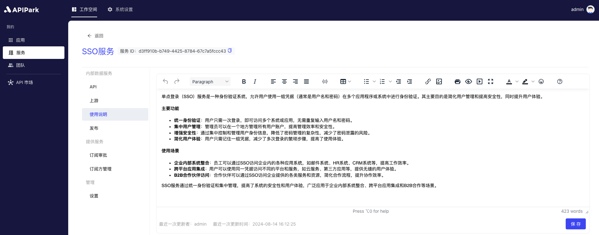
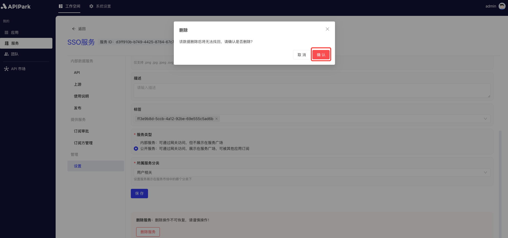

# 服务管理

服务管理模块允许团队创建和管理多个服务，每个服务可以绑定多个API。用户可以将服务展示在服务广场中，供订阅者按需订阅。订阅申请提交后，需经管理员审批，通过后订阅者即可访问该服务下的所有API。通过这一模块，团队能够灵活管理和发布API，订阅者则能方便地获取所需服务，提升了API使用效率和团队协作能力。

:::tip
服务广场展示的服务需要满足以下条件：

* 服务类型为**外部服务**；
* 服务存在**API**，若不存在，请参考教程[添加API](./api.md#添加api)；
* 服务已配置`上游`，若未配置，请参考教程[配置上游](./upstream.md#配置上游)；
* 服务**已发布**，若未发布，请参考教程[发布版本](./release.md#发布版本)。
:::

## 操作演示
### 添加服务
1. 点击`工作空间` -> `我的` -> `服务`，进入服务列表页面，点击`添加服务`。

  

2. 在弹出框中填写服务信息。

  

  

**字段说明**

<table><thead><tr><th width="169">字段名</th><th>说明</th></tr></thead><tbody><tr><td>服务名称</td><td>用来标识和描述该服务的名称。</td></tr><tr><td>服务ID</td><td>服务ID用于唯一标识服务，确保在管理和操作时可以准确区分不同的服务。服务ID在内部系统和调用过程中使用，不易更改。</td></tr><tr><td>API调用前缀</td><td>指调用该服务的API时使用的URL前缀。用于统一管理和路由API请求，确保请求能够正确定位到目标服务。前缀应与服务名称相关联，并易于记忆和使用。</td></tr><tr><td>描述</td><td>记录和展示服务的详细信息和功能说明。</td></tr><tr><td>所属团队</td><td>负责管理和维护该服务的团队。</td></tr><tr><td>图标</td><td>该图标将展示在服务广场中。</td></tr><tr><td>标签</td><td>服务自定义标签，方便订阅方快速查找。</td></tr><tr><td>服务类型</td><td>若为外部服务，订阅方可在服务广场中获取并申请订阅，提供方审批通过后，即可发起调用。 若为内部服务，仅能通过提供方分配订阅方的方式分配调用权限。</td></tr></tbody></table>

填写完成后，点击`提交`即可。

### 编辑服务信息
1. 选择需要编辑的服务，点击进入服务内页。

  

2. 点击`设置`，进入服务设置页面。

  

3. 修改完成后，点击`保存`。

  

### 编辑服务说明
:::tip
若服务为外部服务，且服务已发布，该服务说明将会在API市场的服务详情中展示，并实时更新。
:::
1. 点击`使用说明`。

  

编辑完成后，点击保存即可。

### 删除服务

1. 进入服务设置页面后，点击最下方的`删除服务`。

  

2. 在弹出框中点击`确认`。

  

