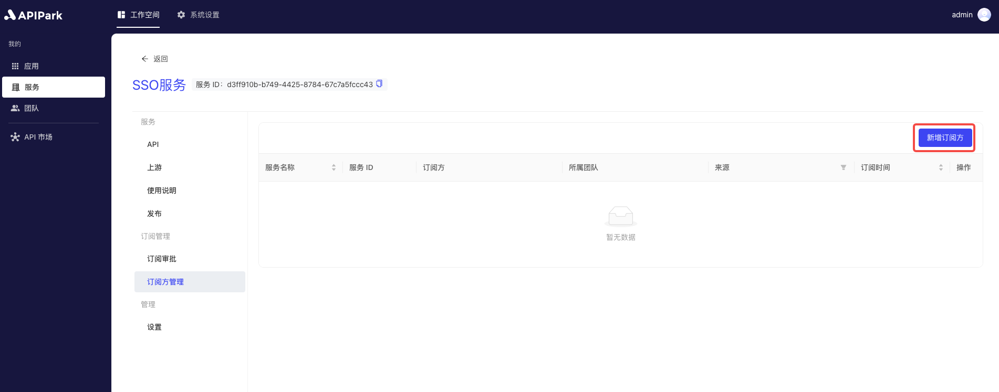
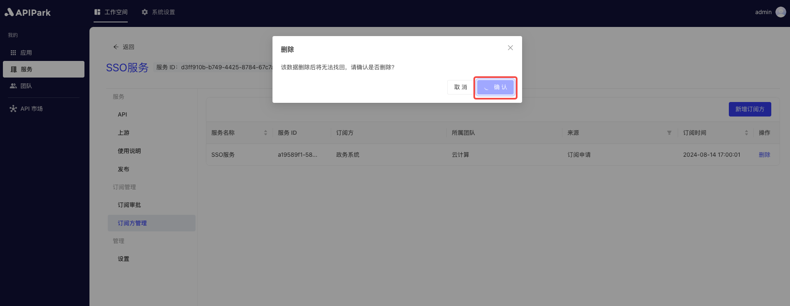

# 订阅方管理

订阅方管理旨在帮助平台管理员有效地管理和控制API的用户及其使用权限。通过订阅方管理，开发者和管理员可以清晰地了解谁在使用API、使用哪些API以及如何使用API，从而保障平台的安全性、可控性和高效性。

### **主要功能**

**订阅申请和审批**：

* **申请流程**：订阅方（应用）可以通过平台申请订阅所需的API服务，填写必要的信息和使用目的。
* **审批流程**：管理员可以审核订阅申请，确保只有符合条件的订阅方才能访问API，保障API的安全性。

**新增/删除订阅方：**

* **创建订阅方**：管理员可以手动添加新的订阅方，指定其可以访问的API和权限。
* **权限撤销**：当订阅方不再需要使用API，或者其行为不符合使用规范时，管理员可以撤销其访问权限。

### **使用场景**

* **企业内部管理**：企业内部多个部门或团队使用API，通过订阅方管理，可以有效地管理和控制各部门或团队的API使用情况。
* **合作伙伴管理**：企业与多个合作伙伴共享API，通过订阅方管理，可以确保合作伙伴的使用行为合规、安全。

## 操作演示

### 新增订阅方
1. 选中需要审批的服务，进入服务内部页面。

2. 点击`订阅方管理`，进入订阅方列表，点击`新增订阅方`。

  

3. 在弹出框中选择需要订阅当前服务的`应用`后，点击`确认`。

  

### 删除订阅方

1. 点击待删除订阅方后方的`删除`。

  

2. 在弹出框中点击`确认`。

  
