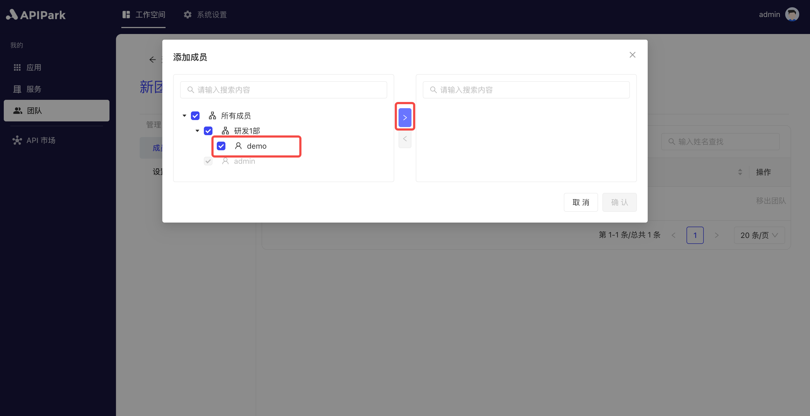

# 团队成员

在成员模块中，管理者可以轻松添加或移除团队成员，并为每个成员分配适当的权限，确保他们只能访问和操作他们被授权的部分。

权限设置功能使得团队管理更加灵活和安全，可以根据不同角色分配不同的访问级别，如管理员、开发者、查看者等。这不仅提高了工作的透明度和效率，还确保了敏感信息的安全管理。

## 操作演示
### 添加成员
:::tip
添加进团队的成员默认获得 `应用开发者` 的团队角色。
:::
1. 点击`工作空间` -> `我的` -> `团队`，进入团队列表页面。

  

2. 点击需要添加成员的团队，进入团队内页。

  

3. 点击`成员`导航栏，点击`添加成员`按钮。

  

4. 在弹出框中选择需要添加到团队中的成员，并把它移动到右边。

  

操作完成后，点击确定即可。

### 移出团队

