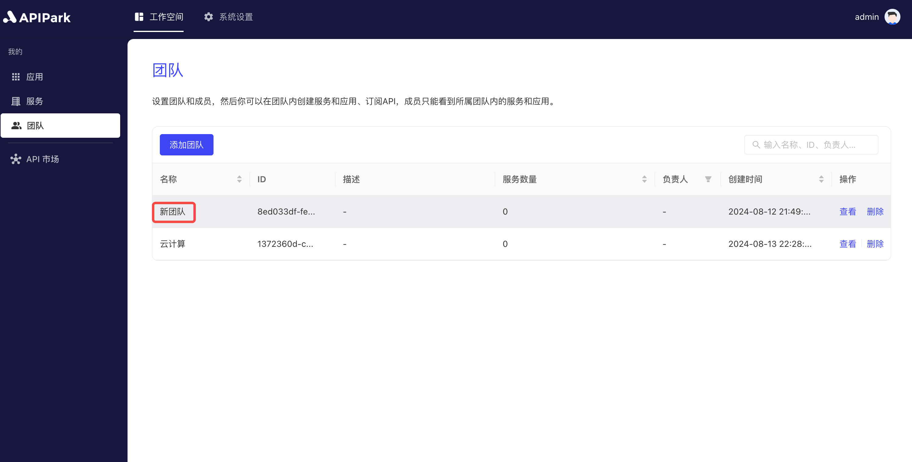
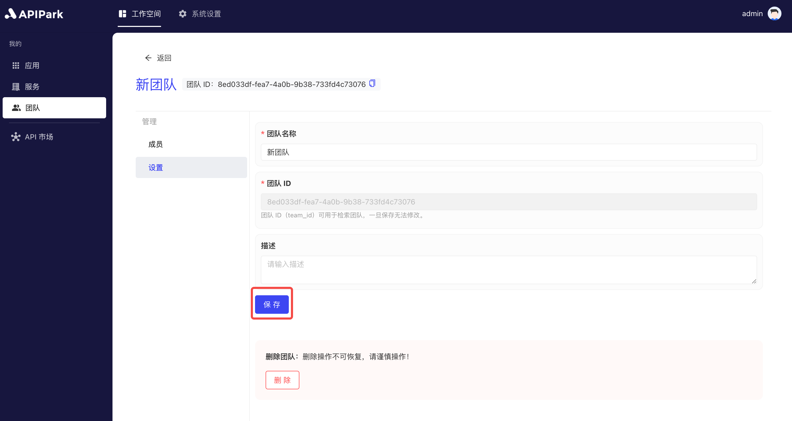
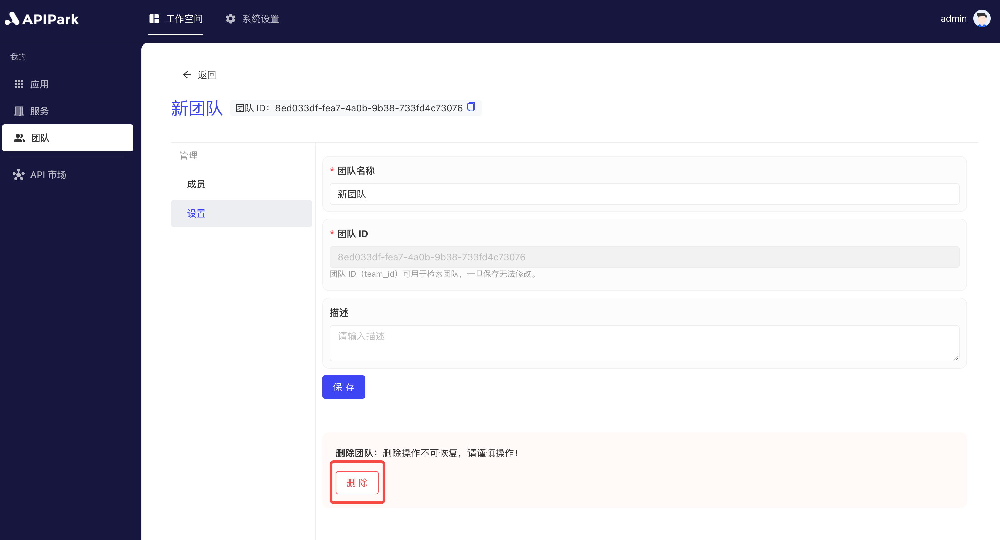

# 团队管理

API 开放平台中的团队模块是一个高效的协作工具，旨在按团队创建和管理服务。通过团队模块，企业可以根据项目需求组建不同的团队，每个团队可以独立管理其 API 服务。团队模块包含一个成员模块，用于管理加入团队的成员。

## 操作演示
### 新建团队
1. 点击`工作空间` -> `我的` -> `团队`，进入团队列表页面。

  

2. 点击`添加团队`按钮。

  

3. 在弹出框中输入团队信息，填写完后点击`确认`。

  

**字段说明**

<table><thead><tr><th width="203">字段名</th><th>说明</th></tr></thead><tbody><tr><td>团队名称</td><td>用于标识和区分不同团队的标识符。团队名称应简洁明了，能够准确反映团队的职责和任务。</td></tr><tr><td>团队ID</td><td>团队唯一标识符，可自定义。</td></tr><tr><td>团队负责人</td><td>指定团队负责人，创建团队后，该负责人将会获得团队管理员的团队角色</td></tr><tr><td>描述</td><td>于记录和展示与特定团队相关的详细信息和备注。</td></tr></tbody></table>

### 编辑团队配置

1. 点击待编辑的团队，进入团队设置界面。

  

2. 编辑团队信息，编辑完后点击保存。

  

### 删除团队
:::tip
删除团队提供两个入口，若团队中存在服务，则该团队不允许删除。
:::
1. 在团队列表中点击删除

  

2. 在团队设置页面中点击删除

  
