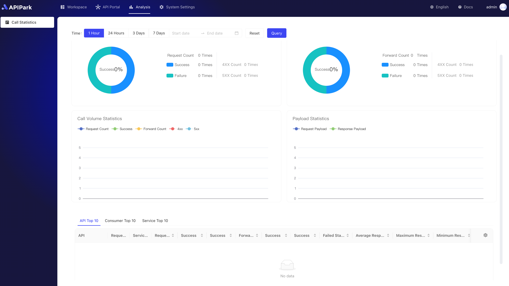

# API Call Analysis Report

APIPark provides insights into long-term API call trends and performance changes by analyzing historical call data, helping businesses maintain API stability.

> 💡 APIPark's API Call Analysis Report relies on the InfluxDB database. If you deploy using the script provided by APIPark, InfluxDB will be installed by default. Learn more: [🔗 Deploy APIPark](deploy.md).
> 💡 You can also deploy an external InfluxDB database and then fill in the InfluxDB data source information in the system settings of APIPark. Learn more: [🔗 Set Data Source](system_setting/data_source.md).

  