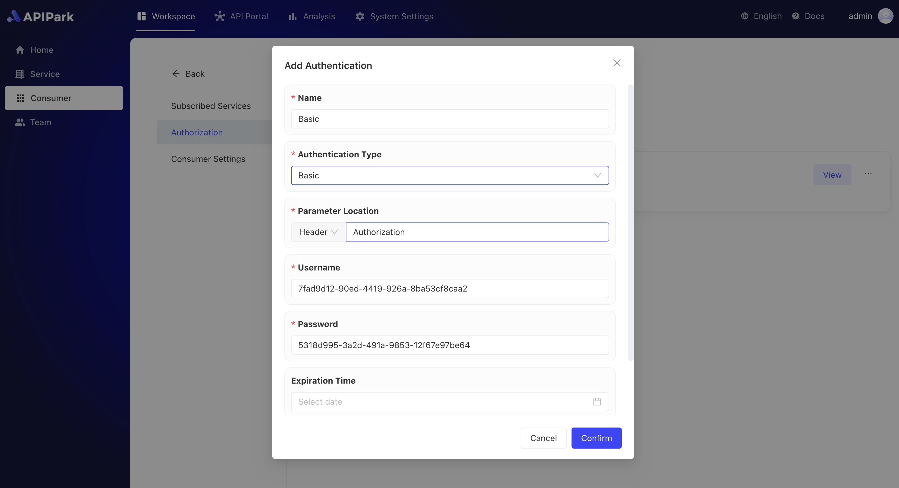

# Basic Authorization

Basic Authorization is a simple HTTP authentication mechanism used to verify the identity of users accessing resources. By transmitting user credentials (typically a username and password) in the HTTP request header, it ensures that only authorized users can access protected resources.

Basic Authorization is a method based on the HTTP protocol. It encodes the username and password into Base64 format and includes them in the HTTP request header, allowing the server to authenticate based on the provided credentials.

## **How It Works**

* **Encoding Credentials**: The client concatenates the username and password in the format "username:password" and encodes it using Base64.
* **Transmitting Credentials**: The encoded credentials are added to the Authorization field in the HTTP request header, prefixed with "Basic".
* **Server Validation**: Upon receiving the request, the server parses the Authorization field, decodes the Base64 string, and verifies the correctness of the username and password.

## Demonstration

1. When configuring authorization, select `Basic` as the authentication type and fill in the authentication information:

  

| Field Name     | Description                                       |
| -------------- | ------------------------------------------------- |
| Parameter Location | Where authentication check is placed in the request: Header, Query, Body |
| Parameter Name | Name of the parameter                             |
| Username       | User's username                                   |
| Password       | User's password                                   |
| Expiry Date    | User expiry date; if not specified, the user never expires. Accuracy is up to days. |
| Hide Authorization Info | Whether to hide authorization information when forwarding to upstream services |

With authorization info included, the access result is as shown below:

