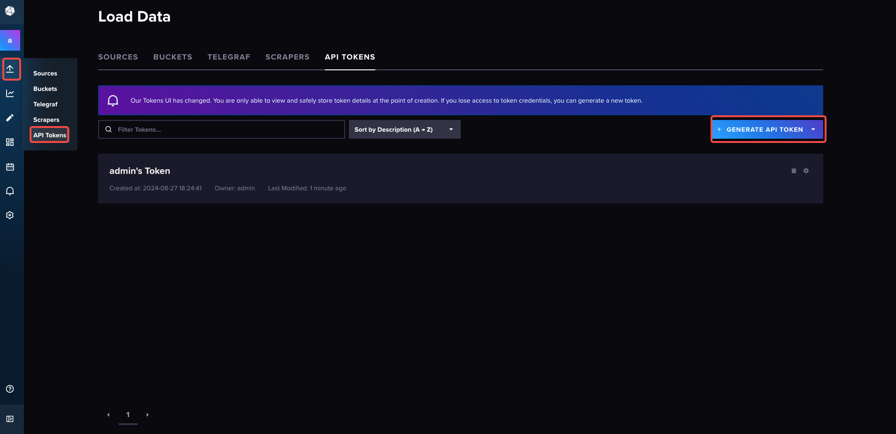

# Deploy APIPark

:::tip

## Minimum Hardware Requirements

* **CPU:** 2 cores
* **Memory:** 4G
* **Disk Storage:** 200G
* **Operating System:** Linux/Mac
* **System Architecture:** amd64/arm64
  :::

## Program Dependencies

`APIPark` relies on the `MYSQL, Redis, InfluxDB` databases. The table below lists the required versions for these databases:

<table><thead><tr><th width="184">Name</th><th>Version Requirements</th></tr></thead><tbody><tr><td>MYSQL</td><td>>=5.7.x</td></tr><tr><td>Redis</td><td>>=6.2.x</td></tr><tr><td>InfluxDB</td><td>>=2.6</td></tr></tbody></table>

## Deployment Method

### Deploying Using Script

:::note
Supported System List:

* CentOS 7.9 (representative of 7.x)
* CentOS 8.5 (representative of 8.x)
* Ubuntu 20.04
* Ubuntu 22.04
* Debain 12.4
* Alibaba Cloud Linux 3.2104
* Alibaba Cloud Linux 2.1903

The current installation has only been tested on the deployments listed above. If you require one-click deployment for other systems, please submit an [Issue](https://github.com/APIParkLab/APIPark/issues) to us.
:::
Enter the one-click deployment command:

```
curl -sSO https://download.apipark.com/install/quick-start.sh; bash quick-start.sh
```

Follow the prompts for deployment. Once deployment is complete, deployment information will be displayed.


## Configuring InfluxDB

### Initializing InfluxDB

:::tip

The one-click deployment script installs the InfluxDB database by default. After deployment is complete, the InfluxDB access address will be displayed, as shown below:

  

:::

1. Open the InfluxDB address in a browser.

  

2. Fill in the initialization information, including username, password, organization name, and bucket name.
   :::warning
   Here, fill in `Organization Name` as `apipark` and `Bucket Name` as `apinto`.
   :::
     

### Creating API Tokens

:::tip

API Tokens in InfluxDB are tokens used for authentication and authorization, allowing users and applications to securely access InfluxDB's data and features. Their main functions are as follows:

1. **Access Control:** API Tokens can be used to control who can access data in the InfluxDB database. Each token can associate different permission levels, restricting access to specific databases, organizations, or resources.
2. **Read/Write Permissions:** API Tokens can differentiate between read and write permissions. You can create read-only tokens, write-only tokens, or tokens with read and write permissions to control the operational capabilities of different users or applications.
3. **Secure Communication:** API Tokens can work with HTTPS to ensure that communication with InfluxDB is encrypted and secure, preventing unauthorized access and data leaks.
4. **Multi-user Management:** In multi-user or multi-tenant environments, API Tokens allow for different tokens to be generated for each user or application and assign different permissions as needed.
5. **Audit and Tracking:** Through API Tokens, you can track which users or applications accessed which data at what time, facilitating logging and security auditing.

:::

1. After entering the InfluxDB browser page, select `API Tokens`.

  

2. Generate an `All Access API Token`.

  

3. Enter the description information and click `SAVE`.

  

4. Copy the generated `API Token`; it will be needed later when [configuring the APIPark data source](system_setting/data_source.md).  

  