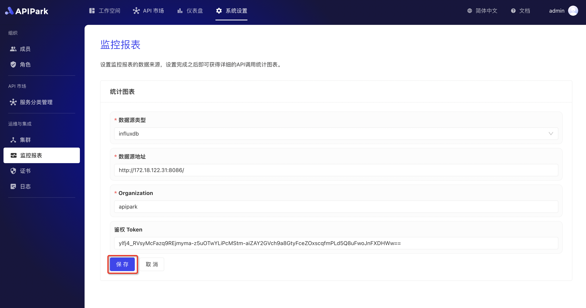
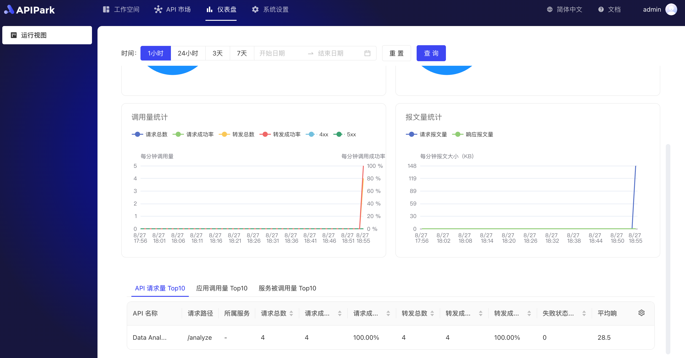

# Configuration Monitoring

## Demonstration
:::tip
Before proceeding with the configuration, you need to have InfluxDB installed and configured. If not, please refer to the guide [Setup InfluxDB](../../install.md#configuring-influxdb)
:::

1. Click `System Settings` -> `Operations & Integration` -> `Monitoring Reports` to enter the monitoring configuration interface, then click `Edit Configuration` on the side.

  

2. Enter the InfluxDB configuration information. After completing the input, click `Save`.

  

## Operational View
:::tip
After configuring monitoring, we can check the API operational status on the dashboard. The dashboard provides various statistical charts to help us understand the API's performance.
:::

  

  