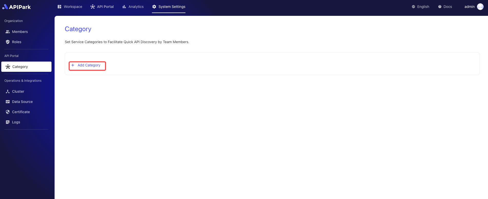
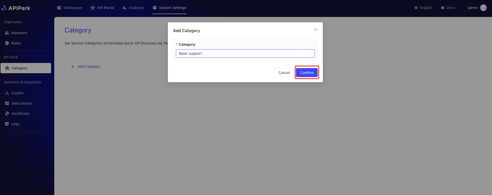

# Add Service Categories

Set optional category tags for APIs to allow team members to quickly find and use the needed APIs in the API marketplace.

With a clear multi-tiered category structure, the discoverability and organization of APIs are enhanced, helping teams to develop and maintain operations more efficiently, thereby improving overall work efficiency and collaboration.

## Operation Demonstration

1. Click `System Settings` -> `API Portal -> `Category` to enter the service category list page.

   

2. Click `Add Category`.

  

3. Enter the category name in the pop-up box and click `Confirm`.

  

