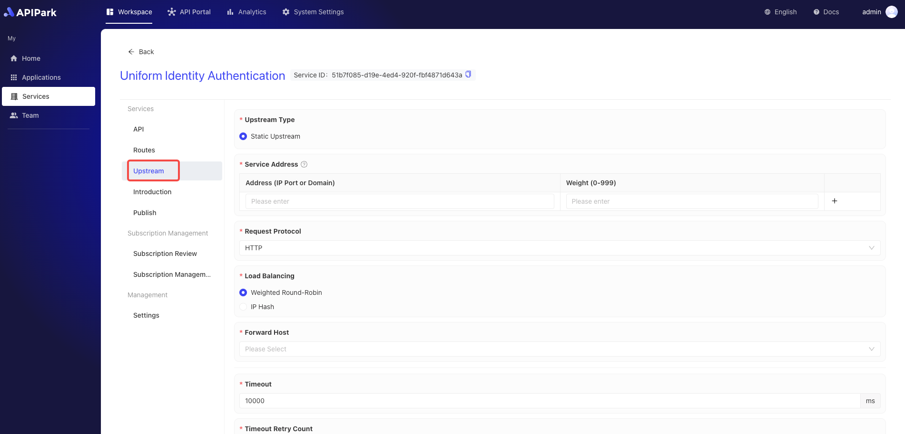

# Configure Upstream

The "upstream" refers to the backend server or service to which API requests are ultimately routed. The upstream usually contains the actual business logic, data storage, and applications that handle API requests. In an API gateway architecture, the gateway receives and processes requests from clients and then forwards these requests to the upstream server for handling, obtains responses, and returns them to the client.

Configuring the upstream is a crucial step in the API open platform to ensure that API requests can be properly routed to the backend services. Upstream configuration involves defining and managing target addresses, load balancing strategies, and failover mechanisms to ensure high availability and performance of services.

## Operation Demonstration

1. Select the service that needs configuration and enter the service's internal page.

  

2. Click on `Upstream` to enter the upstream configuration page.

  

3. Configure the upstream information, and after completing the configuration, click `Save`.

  

**Field Description**

<table><thead><tr><th width="169">Field Name</th><th>Description</th></tr></thead><tbody><tr><td>Upstream Type</td><td>Type of the upstream service; currently, only <code>Static Upstream, which has fixed IP/domain name + port number service entrance</code> is supported.</td></tr><tr><td>Service Address</td><td>The access address of the upstream service; you can fill in multiple upstream addresses and configure the weight of each upstream service.</td></tr><tr><td>Request Protocol</td><td>The protocol to request the upstream service, currently only supports HTTP/HTTPS.</td></tr><tr><td>Load Balancing</td><td>The load balancing algorithm, currently supports Weighted Round Robin and IP Hash.</td></tr><tr><td>Forward Host</td><td>The Host value used when requesting the upstream service; there are three options:  <b>Transmit Client's Request Host:</b> Under this strategy, the gateway or proxy server will not modify the Host header information in the request. It will directly pass the client's (the party initiating the request) original Host header to the upstream service (the actual server providing the service).  This allows the upstream service to recognize the original domain of the request, thereby providing customized content or performing specific logic based on the original request's Host header.  <b>Use the Upstream Service Host:</b>  In this strategy, the gateway or proxy server replaces the original Host header in the request with one or more configured upstream service Host headers.  This is often used to route requests to a specific backend service, regardless of what the Host header in the client's request is. This can simplify the configuration of the upstream service, as they don't need to worry about the Host header information of incoming requests.  <b>Rewrite Host:</b>  This strategy involves modifying the Host header in the request, changing it to a specific value. This can be used in various situations, such as when there is a need to route requests to a different domain or when ensuring requests meet specific format or security requirements.  Rewriting the Host header can provide greater flexibility, but it may also lead to some unexpected behaviors, especially if the clients rely on the original Host header for certain operations.</td></tr><tr><td>Timeout Duration</td><td>The timeout duration for requesting upstream, in ms.</td></tr><tr><td>Timeout Retry Count</td><td>The number of retries allowed when a timeout occurs while requesting the upstream. If multiple service addresses are configured for the upstream, the gateway will re-request the unrequested service addresses.</td></tr><tr><td>Rate Limitation</td><td>The number of requests allowed per second for the current upstream.</td></tr><tr><td>Forward Upstream Request Headers</td><td>The request header information that needs to be added or removed when requesting the upstream; if not configured, the gateway will forward the request headers to the upstream service as they are.</td></tr></tbody></table>

After filling in, click `Save` to complete.