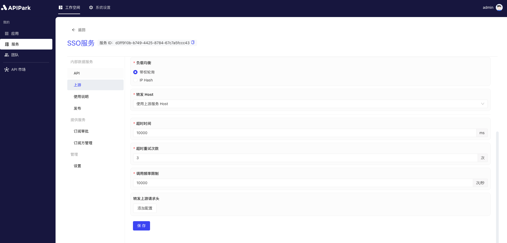

# Configure Upstream

"Upstream" refers to the backend server or service where API requests are ultimately routed. The upstream typically includes the actual business logic, data storage, and applications that process API requests. In an API gateway architecture, the gateway receives and processes requests from clients and then forwards these requests to upstream servers for specific processing, retrieves the response, and returns it to the client.

Configuring upstream is a critical step in the API open platform to ensure that API requests are correctly routed to the backend services. Upstream configuration involves defining and managing target addresses, load balancing strategies, and failover mechanisms to ensure high availability and performance of services.

## Operation Demo

1. Select the service that needs configuration and enter the internal service page.

  

2. Click `Upstream` to enter the upstream configuration page.

  

3. Configure the upstream information. Once the configuration is complete, click `Save`.

  

  

**Field Explanation**

<table><thead><tr><th width="169">Field Name</th><th>Description</th></tr></thead><tbody><tr><td>Upstream Type</td><td>The type of upstream service, currently only supports <code>static upstream, which has a fixed IP/domain + port number service entrance.</code></td></tr><tr><td>Service Address</td><td>The access address of the upstream service. You can fill in multiple upstream addresses and configure the weight for each upstream service.</td></tr><tr><td>Request Protocol</td><td>The protocol for requesting the upstream service, currently supports HTTP/HTTPS only.</td></tr><tr><td>Load Balancing</td><td>Load balancing algorithm, currently supports weighted round robin, IP Hash.</td></tr><tr><td>Forward Host</td><td>Specifies the Host value used when requesting the upstream service. There are three options:  <b>Pass-through client request Host:</b> Under this strategy, the gateway or proxy server does not modify the Host header information in the request. It directly passes the original Host header from the client (the one making the request) to the upstream service (the actual server providing the service). This allows the upstream service to identify the original source domain of the request, thereby providing customized content or executing specific logic based on the original Host header.  <b>Use upstream service Host:</b>  In this strategy, the gateway or proxy server replaces the original Host header in the request with a configured Host header for one or more upstream services. This is usually used to route requests to a specific backend service regardless of the Host header in the client request. This can simplify the configuration of upstream services as they don’t need to care about the Host header information of incoming requests.  <b>Rewrite Host:</b>  This strategy involves modifying the Host header in the request to change it to a specific value. This can be used in various situations, such as when requests need to be routed to a different domain or when ensuring requests meet specific format or security requirements. Rewriting the Host header can provide greater flexibility but may also cause unexpected behavior, particularly if the client relies on the original Host header for certain operations.</td></tr><tr><td>Timeout</td><td>The timeout for requesting the upstream, specified in ms.</td></tr><tr><td>Timeout Retry Count</td><td>The number of times to retry requesting the upstream when a timeout occurs. If multiple service addresses are configured for the upstream, on retry the gateway will request a service address that hasn't been requested yet.</td></tr><tr><td>Call Rate Limit</td><td>The number of requests allowed per second for the current upstream.</td></tr><tr><td>Forward Upstream Request Headers</td><td>When requesting upstream, headers that need to be added or removed. If not configured, the gateway will forward the request headers to the upstream service as they are.</td></tr></tbody></table>

After filling out, click `Save`.