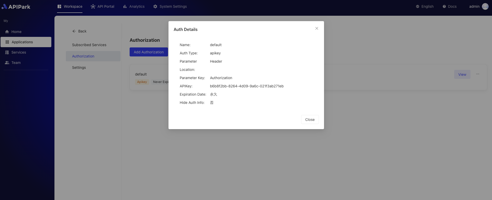
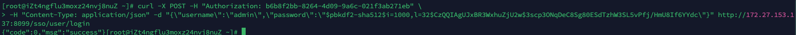

# API Invocation

Once approval is granted, subscribers can use the approved application information to call the APIs of the subscribed services and obtain the actual invocation results. This means that once a subscription request is approved, users can safely access and use the service through the application's access authorization, perform related operations, and receive corresponding data or feedback.

## Operation Demonstration

:::tip

Before invoking, the following conditions must be met:

1. The application is configured with access authorization. If not, please refer to the [Authorize Access](./authorization.md) tutorial.
2. The application has submitted a subscription request for the service to which the API belongs. If not, please refer to the [Request Subscription](./subscribe.md) tutorial.
3. The subscription has been approved. If not, please contact the service provider to approve the request. Refer to the [Approve Subscription](../provider/approve.md) tutorial.

:::

Assuming in the [Authorize Access](./authorization.md) operation, the authentication information is configured as follows:

  

The service address of the cluster is `http://172.27.153.137:8099`, as shown below:

  

The API invocation information is as follows:

  

You can use any of the following methods to invoke the service API.

<details>
<summary>CURL</summary>

Select a `server/VM/PC` that can access the partition gateway node and execute the following command:

```sh
curl -X POST -H "Authorization: 
b6b8f2bb-8264-4d09-9a6c-021f3ab271eb" \
-H "Content-Type: application/json" -d "{\"username\":\"admin\",\"password\":\"$pbkdf2-sha512$i=1000,l=32$CzQQIAgUJxBR3WxhuZjU2w$3scp3ONqDeC8Sg80ESdTzhW3SL5vPfj/HmU8If6YYdc\"}" \
http://172.27.153.137:8099/sso/user/login
```

The invocation result is as shown in the figure:
  

</details>