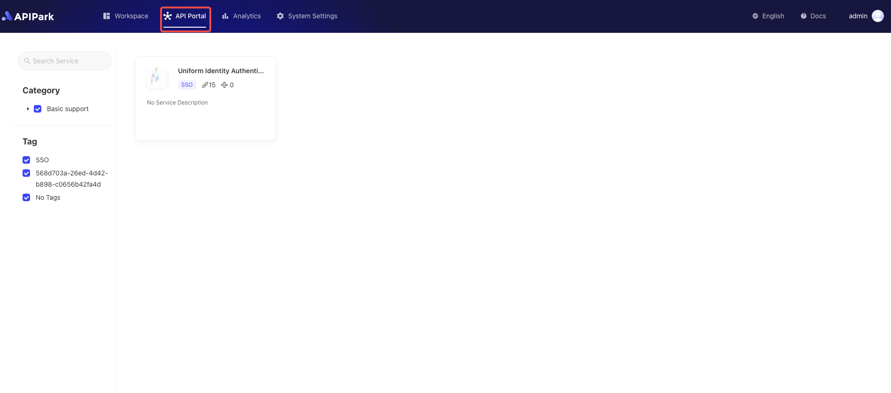
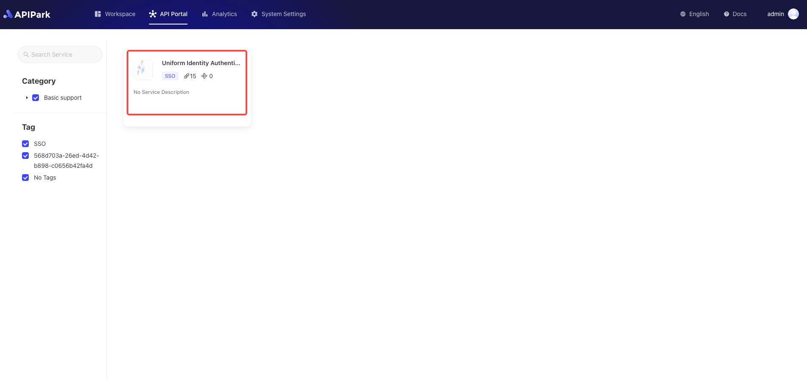

# Subscription Application

Service subscription aims to provide users with convenient API access. Through service subscriptions, users can select and subscribe to the services they need, achieving efficient resource utilization and management.

#### Features

- **Service Browsing and Selection**: Users can browse and select the required services in the service marketplace, learning about detailed service information and related APIs.
- **Subscription Application**: After selecting a service, subscribers can submit a subscription application.
- **Access Permission Allocation**: Once the subscription application is approved, users can access all APIs under that service, enjoying convenient resource invocation.
- **Subscription Management**: Users can manage subscribed services, view subscription status at any time, and adjust subscription content.

#### Use Cases

- **Developer Integration**: Developers can subscribe to relevant services according to project needs, quickly integrating the required APIs to accelerate the development process.
- **Internal Enterprise Applications**: Different departments within an enterprise can subscribe to related services as needed, achieving data sharing and business synergy, thereby improving work efficiency.
- **Third-party Collaboration**: Partners can subscribe to enterprise-provided services to achieve system integration and business cooperation, simplifying the cooperation process and enhancing collaboration efficiency.

The service subscription module simplifies the API access process and permission management, enhancing user experience and system security, and is widely applicable to developers, internal enterprise applications, and third-party collaboration scenarios.

## Operational Demonstration

:::tip
Before subscribing to a service, ensure that there is an **application**. If not, please refer to the tutorial [Add Application](./application.md#add-application).
:::

1. Click `API Portal` to enter the service list page.

  

2. Select the service you wish to apply for and click to enter the service details page.

  

3. Click `Apply`.

   

4. Select `Application` in the pop-up box.

  

