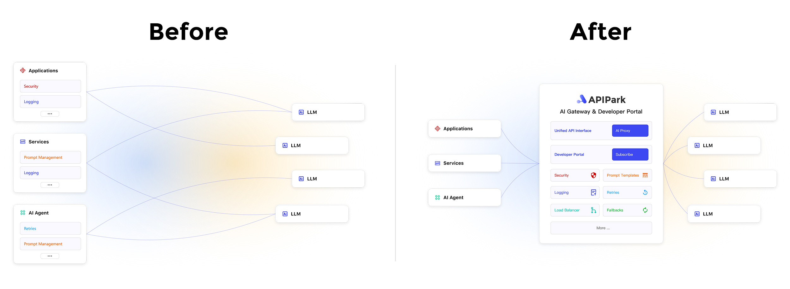

# AI Services (AI Gateway)

👀 As AI rapidly evolves, different AI providers (including open-source and self-hosted models) have inconsistent API designs and call methods, making it very complex for developers and enterprises to use and manage AI services.

✨ APIPark's AI Service (AI Gateway) provides unified access management for multiple AI models, helping developers quickly integrate and call various AI models. APIPark simplifies the call process through a unified API format, reducing the complexity of switching models, and also supports encapsulating Prompts into standard REST APIs for easy API reuse and sharing. APIPark supports full lifecycle management of APIs, including the entire process from design, release, to calling and decommissioning, and also offers a subscription approval mechanism to enhance data security.

📍 Steps to use APIPark AI Service:

1. Set up an AI model provider
2. Create and publish AI services
3. [Optional] Create consumers and subscribe to services
4. [Optional] Call the API

# Setting Up AI Model Providers

Before creating AI services, you first need to configure AI model providers. APIPark supports over 100 AI models, including OpenAI, Anthropic, AWS Bedrock, Google Gemini, etc. Once configured, you can choose different models to create AI services and manage all authorization information and cost statistics of AI services in APIPark.

Navigate to the **System Settings** module, select **AI Model Management** from the sidebar, and you can see all the AI providers supported by APIPark in the list.

To access OpenAI as an example, click the settings button, and in the popup:

- Select **Default AI Model**: When creating APIs in AI services later, the system will automatically set the default AI model for the API, reducing user operations.
- Fill in **Provider Configuration**: Each provider has different configuration information, and the system will automatically generate the required configuration information based on the provider you choose. Configuration information can generally be obtained from the provider's Open API management backend, and you can find a quick jump button to the provider's official website at the bottom left of the popup.

> 💡 If APIPark does not support the AI provider you use, feel free to [🔗 Submit an Issue to us](https://github.com/APIParkLab/APIPark/issues/new)

# Creating and Publishing AI Services

## 1. Creating AI Service

Enter the **Workspace** module, select **Services** from the sidebar, then **Create Service**, and fill in:

- **Service Name**
- **Service ID**: A unique identifier for the service, which cannot be modified once saved.
- **Service Type**, select **AI Service**:
  - **AI Service**: AI Gateway, converting different AI models and Prompts into unified REST APIs through APIPark.
  - **REST Service**: Traditional API Gateway, which can connect to microservices or HTTP REST APIs.
- **Default AI Provider**: Select the AI provider whose API will be the default within the service.
- **API Request Prefix**: Set a unified request prefix for all APIs of the service, which cannot be modified once saved.
- **Team**: If you have joined multiple teams, set which team is responsible for managing the service.
- **Subscription Review**:
  - **No Review Needed**: All consumers can subscribe to and call the service.
  - **Manual Review**: Only consumers who pass the review can call the service.
- **Service Category**: Select which category the service is published to in the API portal.

## 2. Creating API

After creating a service, APIPark will automatically create a default **Unified API** within the service, which you can use directly to call AI services.

If you need to combine Prompts and AI models into a custom AI API, click **Create API** on the API page, and fill in:

- **API Name**
- **API Request Path**
- **Prompt**: Define the operations AI needs to execute, such as turning AI into a translation API or a data analysis API with the prompt.
- **Variables**: Use variables if you wish to append request content into the prompt. The prompt can define variables using `{{param}}`, and they will be passed as API request parameters.
- **API Description**
- **Timeout Duration**: Typically, API requests have a timeout limit to avoid a large number of timeout requests affecting APIPark's performance.
- **Max Retry Count**: When API requests timeout or AI models return errors, APIPark will automatically retry the request. If the max retry count is exceeded, an error will be returned to the caller.

When you create an API, APIPark will automatically generate an API document, which can be viewed by selecting **API Documentation** from the sidebar.

## 3. Publishing Service

✨ If there are changes in the **API, API documentation, usage instructions, upstream** of a service, you need to publish a new version for the new configuration to take effect.

Select **Publish** from the sidebar, then click **New Version**, and fill in:

- **Version Number**
- **Version Description**

Click **Confirm** to complete the publication.

> 💡 If this is the first time the service is being published, it will appear in the **API Portal** and can be subscribed by **consumers**.
> 💡 If the service has **manual review** enabled, consumers subscribed to the service will need to wait for **service admin** approval before they can call the API.

# [Optional] Creating Consumers and Subscribing to Services

APIPark provides an **API Portal** feature, allowing users to publish services to the API portal where they can be viewed, subscribed to, and called by other users.

To ensure the secure and regulated use of APIs and reduce API management costs, users must first create **consumers** and subscribe to services through consumers, then use the consumer's **authorizing certificate** to call APIs.

[🔗 Learn more: Consumers](../consumers.md)

# [Optional] Calling the API

[🔗 Learn more: Calling API](../call_api.md)