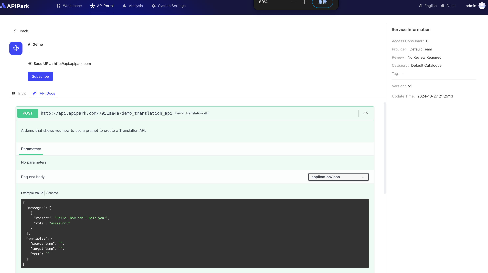
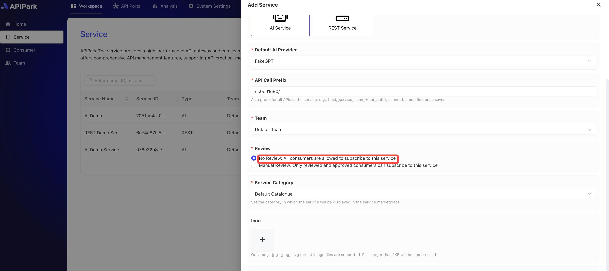

# Consumer Review

After a service is published, all **REST services** and **AI services** are centrally showcased in the API portal for consumers to browse and select. Consumers can view detailed information about each service through the portal, including function descriptions, interface documentation, and call examples, in order to choose the most appropriate service based on business needs and initiate a subscription request.

Once a subscription request is submitted, the system will push the request information to the service provider for review. Upon approval, the consumer will receive a notification of successful subscription and officially gain access to the corresponding API interface. During the review period, consumers can check the status of their request to ensure transparency and efficiency in the service access process.

The specific process is as follows:

**Service Display**: The API portal centrally displays various REST and AI services, providing search, filtering, and classification functions to help consumers quickly locate the services they need. The service detail page displays key information such as function introduction, use cases, API documentation, and available data formats.

  

  

**Subscription Request**: After selecting a service, consumers can submit a subscription request online, providing details such as intended use and expected calls, to assist the service provider's evaluation.

  

  

**Review Process**: The service provider will receive the subscription request and review the consumer's qualifications and intended use based on the request information. This process helps ensure the security and applicability of the service.

If the service is created with the option of no review required, then once a consumer applies for a subscription, it will automatically be approved without the need for the service provider to review, as shown below:

  

  

If the service is created with the manual review option, then after a consumer submits a request, it requires review by the service provider before the consumer can invoke the service, as shown below:

  

  

  