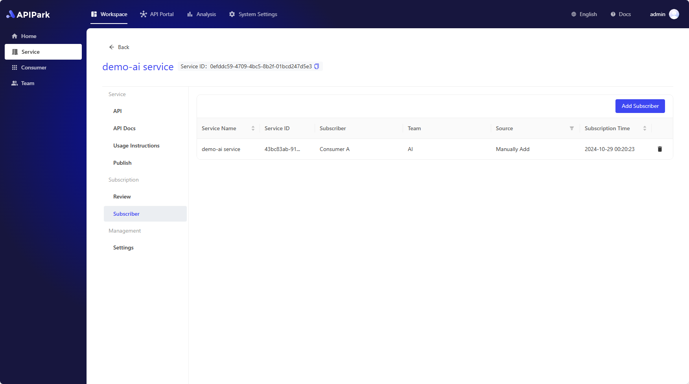

# Review Consumers

In APIPark, **Consumers** are entities that **subscribe to services** and **call APIs**. Consumers gain the right to call APIs within a service by subscribing to the service, ensuring data security and access compliance.

To ensure secure and standardized API usage, and to reduce API management costs, users must first create **consumers** and have consumers subscribe to services.

Consumers who have subscribed to services will appear on the service's **review** list. There are two ways to review:

- **No review required**: APIPark automatically approves the consumer's subscription request, allowing them to call the service's APIs immediately after subscribing.
- **Manual review**: After the consumer subscribes to the service, they must wait for the service administrator's approval before they can call the service's APIs; otherwise, APIPark will reject the API request and indicate a lack of API access permissions.

## No Review Required

If a service is set to **no review required**, APIPark will automatically approve the consumer's subscription request. The consumer can call the service's APIs immediately after subscribing.

You can view all **consumers** who have subscribed to the service in the service's **Subscribers** list.

## Manual Review

If a service is set to **manual review**, the consumer must wait for the service administrator's approval after subscribing to the service before they can call the service's APIs. Otherwise, APIPark will reject the API request and indicate a lack of API access permissions.

You can see consumers waiting for review in the service's **Review** list.

# Changing the Service Review Method

If you wish to change the service's review method, go to the service management interface, click on **Service Settings** in the sidebar, modify the **Review** option, and then click save.

