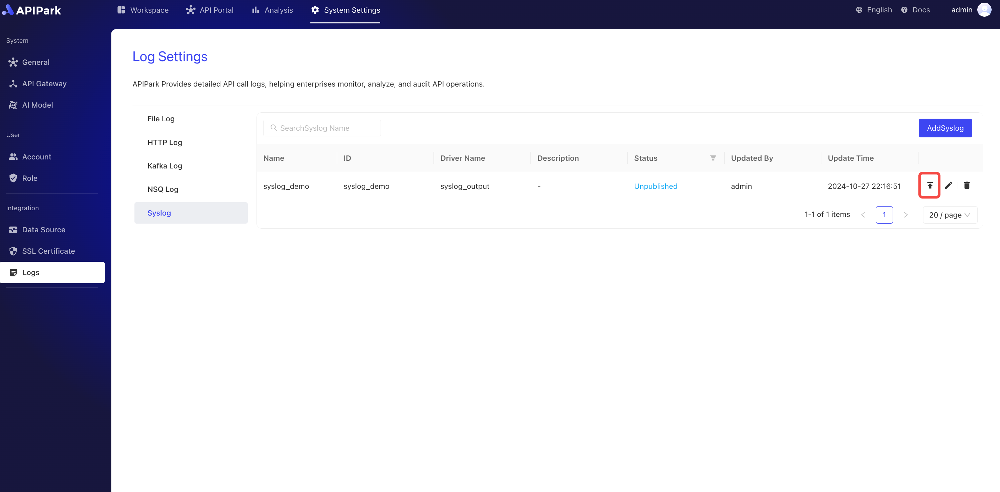

# Syslog Logs

## Introduction

Collect log information from the request gateway and output it to `Syslog`.

## Features

Logs generated during program execution can be output to a remote Syslog server.

* Supports various request protocols, including TCP, UDP, UNIX.
* Supports setting Syslog output log levels.
* Supports different log output format types.
* Supports custom log formatting configurations.

## Operation Demonstration

### Create a New Syslog Log Configuration

1. Click `Operations & Integration` -> `Syslog Logs`, then click `Add Syslog Log`.

  

2. Fill in the Syslog log configuration, and after completion, click `Confirm`.

  

**Configuration Instructions**:

| Field Name   | Description                                               |
| ------------ | --------------------------------------------------------- |
| Network Protocol | Protocol for requesting Syslog service, supports TCP, UDP, UNIX |
| Server Address | Syslog service address                                   |
| Log Level   | Syslog output log level, supports ERROR, WARN, INFO, DEBUG, TRACE |
| Output Format | Log content format for output, supports single line, JSON format |
| Formatting Configuration | Template for the output format, tutorial [click here](https://help.apinto.com/docs/formatter) for more information |

**Formatting Configuration Example**

```json
{
   "fields": [
      "$time_iso8601",
      "$request_id",
      "@request",
      "@proxy",
      "@response",
      "@status_code",
      "@time"
   ],
   "request": [
      "$request_method",
      "$scheme",
      "$request_uri",
      "$host",
      "$header",
      "$remote_addr"
   ],
   "proxy": [
      "$proxy_method",
      "$proxy_scheme",
      "$proxy_uri",
      "$proxy_host",
      "$proxy_header",
      "$proxy_addr"
   ],
   "response": [
      "$response_headers"
   ],
   "status_code": [
      "$status",
      "$proxy_status"
   ],
   "time": [
      "$request_time",
      "$response_time"
   ]
}
```

### Release

1. Click the `Release` button next to the configuration to be released.

  