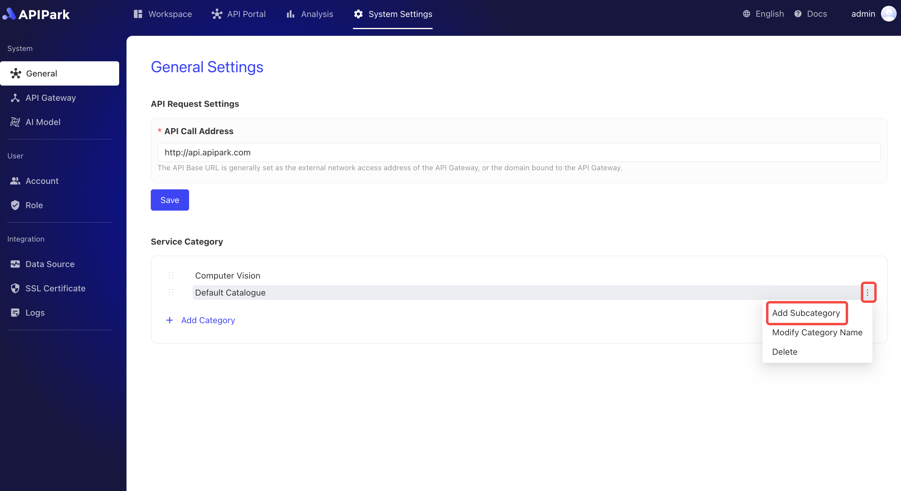

# General Settings

This module allows configuration of APIPark's general settings, including the API call address displayed on the API portal and the service categorization information bound to services.

## Configuring API Request Address

On the API Park platform, the **API Request Address** setting is used to specify the base URL for interface calls, which provides a prefix for the full path of API requests. Once the API request address is configured in the system settings, the platform automatically applies it as a prefix to both the display in API documentation and the actual request path, ensuring a consistent address format and enhancing management and call convenience.

### Key Functional Logic

1. **Set Base URL**: Administrators can configure the `API Request Address` in the "General Settings" under system settings, such as `http://api.apipark.com`. This serves as the foundational path for the platform's APIs, prefixing all API call addresses.
2. **Document Display**: In the API portal, when users view API documents, the configured base URL automatically appears before the API address. For example, the path for a translation API `/demo_translation_api` would be displayed as `http://api.apipark.com/demo_translation_api`.
3. **Unified Call Path**: By setting a unified `API Request Address` in the system, users only need to focus on the specific API resource path during calls without manually appending the base path, reducing the risk of errors and configuration complexities.
4. **Dynamic Updates**: If the `API Request Address` changes, all API paths displayed in documentation automatically update to maintain consistency between documentation and actual call addresses, ensuring system flexibility and ease of maintenance.

### Application Scenarios

- **Unified Management**: Suitable for scenarios requiring uniform management of API request addresses, ensuring all API services are published under the same domain or base path for easy maintenance and security control.
- **Multi-Environment Support**: Different `API Request Addresses` can be used across various environments (like development, testing, production) without modifying each API's path configuration.

### Operation Steps

1. Click on `System Settings` -> `General` to enter the general settings page

  

2. Input the API call address in the format `http/https` + `://` + `{ip}`/`domain` + `port`. After completion, click `Save`.

  

Once configured, the API call address will automatically populate in the documentation as shown below:

  

## Service Categorization

On the API Park platform, the **Service Categorization Module** is used for organizing and managing different types of services. When services are created (including REST services and AI services), the system requires them to be bound to a service category, facilitating filtering and browsing services by category in the API portal. This module enhances the organization of service management and aids users in quickly finding required services in the API portal.

### Key Features

1. **Category Binding**: Each newly created service must be bound to a service category. This allows both REST and AI services to be organized by function or application scenario, facilitating management and use.
2. **Service Filtering**: In the API portal, users can filter the service list based on service categories. This allows users to locate services quickly through categories, particularly effective when there are many services.
3. **Subcategory Support**: The service categorization module supports the creation of subcategories for more detailed category management. For example, different fields of subcategories can be created under the "AI Services" category (such as natural language processing, computer vision, etc.), helping users to find specific services more accurately.
4. **Sorting Functionality**: Categories and subcategories support sorting, allowing administrators to adjust the display order based on priority or frequency of use, making important or frequently used categories more prominent.

### Application Scenarios

- **Clear Category Management**: Through layered management and display of services, allowing developers, testers, and business personnel to quickly find required services.
- **Enhanced User Experience**: In the API portal, service categorization aids users in filtering and locating needed services, especially effective in scenarios with extensive service offerings and applications.

The service categorization module plays a crucial role in organization and navigation on the API Park platform. Through features like category binding, filtering, subcategories, and sorting, it provides an efficient solution for managing, using, and finding services, greatly optimizing the user experience and system maintainability.

### Operation Steps

#### Create a New Category
1. Click on `System Settings` -> `General` to enter the general settings page, then click `New Category`.
  

2. Fill in the category name in the popup box and click `Confirm`.
  

#### Create a New Subcategory
1. Click the menu button behind the category, and select `New Subcategory` in the popup box.
  

2. Fill in the subcategory name in the popup box and click `Confirm`.
  

#### Category Sorting
1. Click the sorting button in front of the category, as shown below
  

2. Drag the category until the sorting is accurate, as shown below
  

  