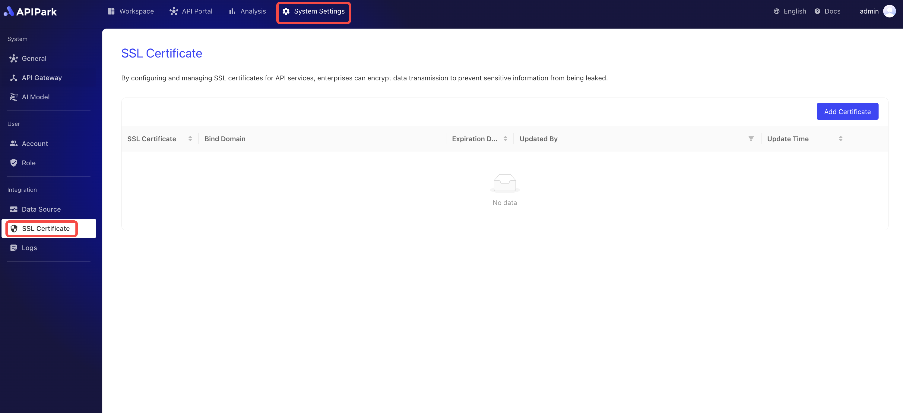

# SSL Certificates

**APIPark** offers management capabilities for **API Gateway SSL Certificates**, ensuring secure, encrypted communication through the **HTTPS protocol** when consumers access API services. By centrally managing SSL certificates, the platform provides convenient maintenance and updates, enhancing the security and reliability of API services.

* **Centralized SSL Certificate Management**: **APIPark** supports unified management of API Gateway SSL certificates, including adding, updating, renewing, and deleting operations, simplifying operational processes, and ensuring that the API gateway always has valid SSL certificates.

* **Secure HTTPS Access**: When consumers call API services, they establish a secure connection with the API gateway through the HTTPS protocol. All data transmission is encrypted to prevent data leaks or tampering, enhancing the security of sensitive data.

* **Automated Certificate Updates and Expiry Alerts**: **APIPark** offers certificate expiry alerts and automatic updates, avoiding service interruptions or security risks due to expired certificates, ensuring the API gateway always has up-to-date SSL certificates.

* **Enhanced Consumer Trust**: HTTPS security indicators allow consumers to confirm the legitimacy and security of API services, increasing trust in the platform, which can help improve user experience and professionalism.

* **Cross-Environment SSL Compatibility**: **APIPark** supports SSL certificate management for different environments (such as development, testing, and production), ensuring that API gateways in all environments can provide secure HTTPS access, facilitating flexible environment management and rapid deployment.

Through these SSL certificate management features, **APIPark** effectively improves the security, operational efficiency, and user experience of API services, providing consumers with a secure and reliable API access guarantee.

### Adding a Certificate
:::tip
Before adding a certificate, you need to have an available API Gateway cluster. If not, please refer to the tutorial [Configure API Gateway Cluster](./api_gateway_cluster.md).
:::
1. Click `System Management` -> `SSL Certificates` to enter the certificates list page.

2. Click `Add Certificate`.

3. In the pop-up box, upload the key (`.key`) and certificate (`.pem` or `.csr`) files.

After uploading, click `Confirm`.

### Modifying a Certificate
1. Click the `Edit` button next to the certificate you want to modify.

2. In the pop-up box, upload the key (`.key`) and certificate (`.pem` or `.csr`) files.

After uploading, click `Confirm`.

### Deleting a Certificate

Click the `Delete` button next to the certificate you want to delete.

