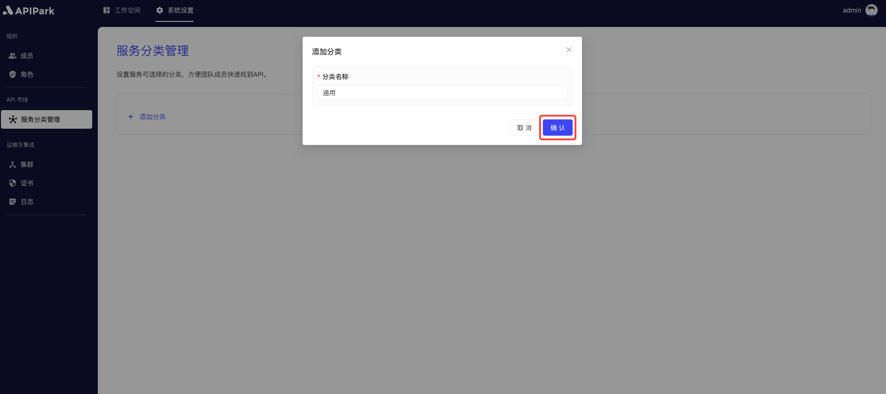
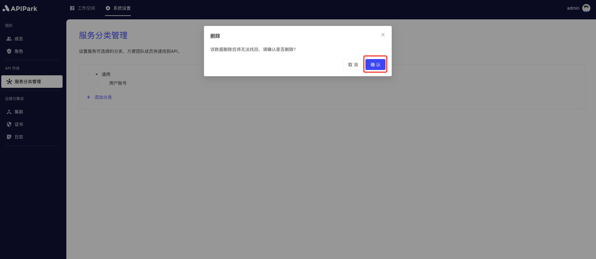

# Service Category Management

Set optional category tags for APIs to allow team members to quickly find and use the required APIs in the API marketplace.

With a clear multi-level category structure, API discoverability and organization are improved, helping the team to carry out development and operations work more efficiently, thus enhancing overall work efficiency and cooperation levels.

:::tip
At least one category needs to be bound when a service needs to be displayed in the service marketplace.
:::
## Operation Demonstration
### Add a Category
1. Click `System Settings` -> `API Marketplace` -> `Service Category Management` to enter the service category list page.

  
2. Click `Add Category`.

  

3. Enter the category name in the pop-up box and click `Confirm`.

  

### Add a Sub-category
1. Click the menu button behind the category and select `Add Sub-category`.

  

2. Enter the sub-category name in the pop-up box and click `Confirm`.

  

### Edit Category Name
1. Click the menu button behind the category and select `Edit Category Name`.

  

2. Enter the new category name in the pop-up box and click `Confirm`.

  

### Delete a Category

1. Click the menu button behind the category and select `Delete`.

  

2. Click `Confirm` in the pop-up box.

  

### Modify Category Order

Drag the sorting button in front of the category.

  