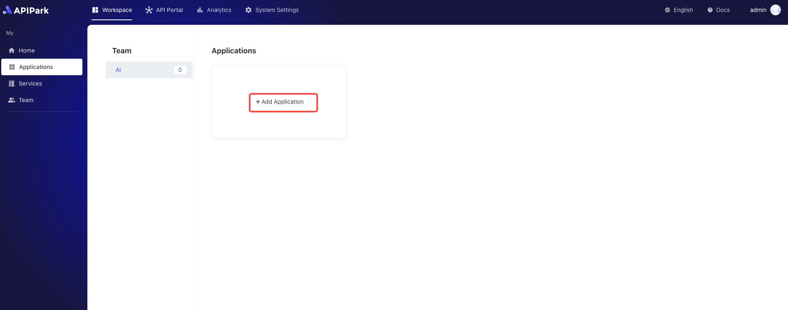
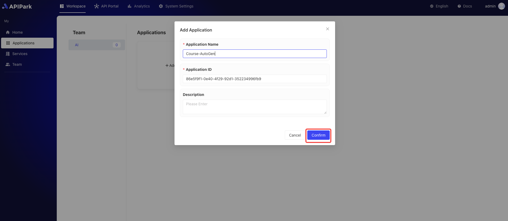

# Application Management

In `APIPark`, **applications** are units used by service subscribers to manage and organize API subscriptions. Each subscriber can create and manage multiple applications, and operate based on applications when subscribing to API services. This allows for flexible management of API subscriptions and calls for different projects or business lines.

## Operational Demonstration
### Adding an Application
1. Click on `Workspace` -> `My` -> `Applications` to access the application list.

    

2. Select the team for which you want to add an application, and click `Add Application`. 

  

3. Enter the application information in the pop-up box. After completing the form, click `Confirm`.

  

### Editing Application Information
1. Choose the application you want to edit, and click to enter the application details page.

  

2. Click `Application Management`, edit the application information, and click save after editing.

  

### Deleting an Application

1. On the `Application Management` page, click `Delete Application` at the bottom.

  