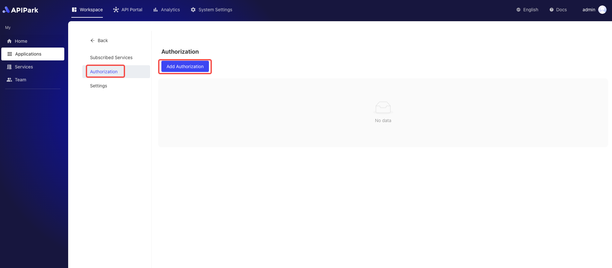
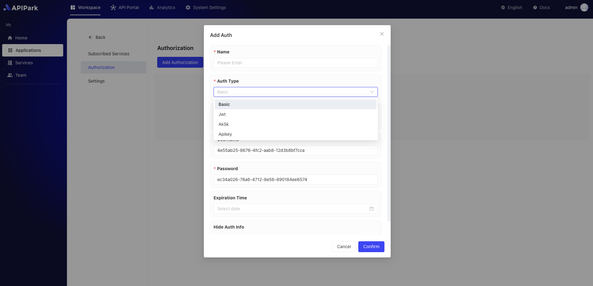

# Access Authorization

In `APIPark`, subscribers subscribe to services based on applications. Each application has its own access authorization management. Once the subscription request is approved, users can use the application's access authorization information (such as API keys or tokens) to call the subscribed services. This ensures that applications adhere to security policies when calling APIs and prevents unauthorized access, ensuring the security and stability of the services.

## Operation Demonstration

### Configuring Access Authorization

1. Select the application for which you need to configure access authorization and click to enter the inner page.

  

2. Click `Access Authorization`, enter the authorization list page, and click the `Add Authorization` button.

  

3. Choose an authentication method and fill in the relevant information. Below, Basic authorization is chosen:

  

Furthermore, the platform currently supports various authentication methods such as `Apikey`, `JWT`, and `AK/SK`, among others.

For different types of authentication methods, the relevant common configuration fields are as follows:

<table><thead><tr><th width="182">Field Name</th><th>Description</th></tr></thead><tbody><tr><td>Name</td><td>Authentication identifier, it is recommended to use a meaningful name.</td></tr><tr><td>Parameter Position</td><td>The parameter position where the authentication information is transmitted, supporting Query and Header.</td></tr><tr><td>Parameter Key</td><td>Define from which key to retrieve the parameter value.</td></tr><tr><td>Expiration Time</td><td>Authentication expiration time; if not set, it will never expire.</td></tr><tr><td>Hide Authentication Information</td><td>Whether to hide the authentication fields when forwarding to upstream services.</td></tr></tbody></table>

For more details on using authentication, you can refer to the tutorials below:

* [APIKey](./apikey.md)
* [Basic Authorization](./basic-auth.md)
* [AK/SK](./aksk.md)
* [JWT](./jwt.md)