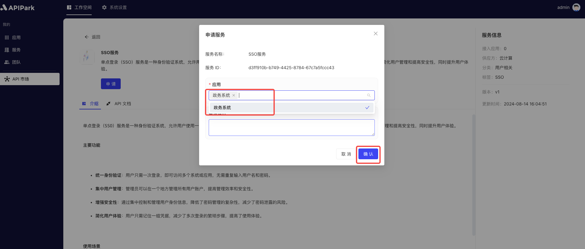
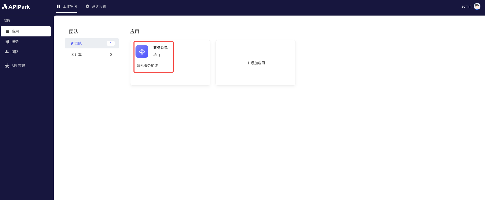

# Service Subscription

Service subscription aims to provide users with convenient access to APIs. Through service subscription, users can select and subscribe to the services they need on demand, achieving efficient resource utilization and management.

#### Features

- **Service Browsing and Selection**: Users can browse and choose the required services in the service plaza, understanding the detailed information and related APIs of the services.
- **Subscription Application**: After selecting services, subscribers can submit a subscription application.
- **Access Permission Allocation**: Once the subscription application is approved, users can access all APIs under that service, allowing convenient resource invocation.
- **Subscription Management**: Users can manage subscribed services, view subscription status anytime, and adjust subscription content.

#### Use Cases

- **Developer Integration**: Developers can subscribe to the necessary services according to project needs, quickly integrate required APIs, and accelerate the development process.
- **Internal Enterprise Applications**: Different departments within an enterprise can subscribe to relevant services on demand, achieving data sharing and business collaboration to improve work efficiency.
- **Third-Party Collaboration**: Partners can subscribe to services provided by enterprises for system integration and business collaboration, simplifying cooperation procedures and enhancing collaboration efficiency.

The service subscription module simplifies the API access process and permission management, improving user experience and system security, and is widely applicable for developers, internal enterprise applications, and third-party collaborations.

## Operation Demo

### Subscribe to Services
:::tip
Before subscribing to services, ensure there exists an **application**. If not, please refer to the tutorial [Add Application](application.md#添加应用).
:::

1. Click `Workspace` -> `API Market` to enter the service list page.

  

2. Select the service you want to apply for and click to enter the service details page.

  

3. Click `Apply`.

  

4. Choose the `Application` in the pop-up box.

  

### View Services Subscribed by Applications
1. After application completion, click `Workspace` -> `Applications` to enter the application list page.

  

2. Select the application you want to view and enter the application internal page.

  

3. Click `Subscribed Services` to view the approval status of the services that have been applied for subscription.

  