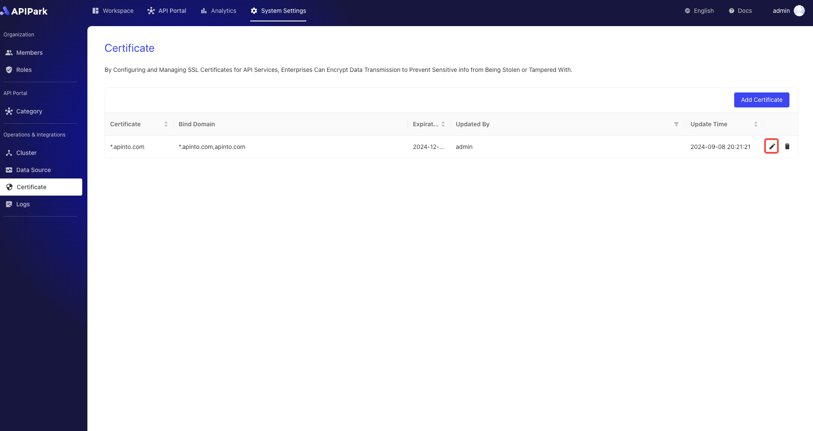
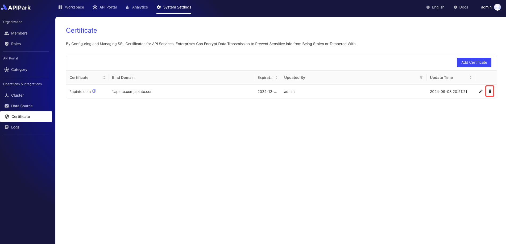
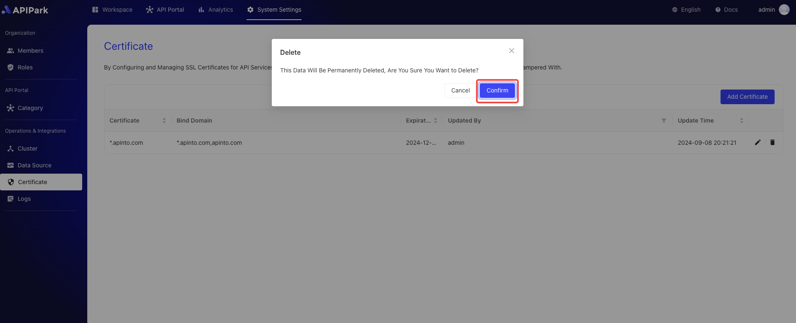

# Certificates

By configuring and managing SSL certificates for API services, businesses can encrypt data transmissions to prevent sensitive information from being stolen or tampered with.

## Operations Demonstration

### Adding a Certificate
:::tip
Before adding a certificate, you need to [configure cluster nodes](./cluster) first.
:::
1. Click `System Certificates` -> `Operations and Integrations` -> `Certificates` to enter the certificate list page. Click `Add Certificate`.

  

3. In the pop-up dialog, upload the key (`.key`) and certificate (`.pem` or `.csr`) files.

  

After uploading, click `Confirm`.

### Modifying a Certificate
1. Click the `Edit` button next to the certificate you wish to modify.

  

2. In the pop-up dialog, upload the key (`.key`) and certificate (`.pem` or `.csr`) files.

  

After uploading, click `Confirm`.

  

### Deleting a Certificate

1. Click the `Delete` button next to the certificate you wish to delete.

  

2. In the pop-up dialog, click the `Confirm` button.

  
