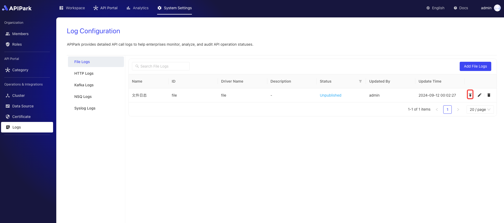

# File Logging

Collect and output log information from the request gateway into files for developers to review.

## Features

File Logging: Outputs request information to log files with the following features:

* Customize the directory and file name for storage
* Split log files periodically to avoid large files that are hard to view
* Scheduled deletion of expired files to reduce hard drive space usage

## Operation Demonstration

### Create a New File Log Configuration

1. Click `System Settings` -> `Operations and Integration` -> `Logs` -> `File Logs` on the left navigation bar, then click `Add File Log`.

  

2. Fill in the File Log Configuration

  

**Configuration Explanation**:

| Field Name   | Description                                                   |
| ------------ | ------------------------------------------------------------- |
| File Name    | The stored file name, the actual stored name will have a `.log` suffix, i.e., \{File Name\}.log |
| Storage Directory | The directory where files are stored, supports relative and absolute paths |
| Log Splitting Cycle | Create new log files periodically, old log files will be renamed, options: Hour, Day |
| Expiry Time  | File retention time, in days, files exceeding this will be deleted periodically |
| Output Format | Format of output log content, supports Line, Json format    |
| Formatting Configuration | Template for output format, tutorial [click here](https://help.apinto.com/docs/formatter) to navigate |

**File Lifecycle Demonstration**


**Formatting Configuration Example**

```json
{
   "fields": [
      "$time_iso8601",
      "$request_id",
      "@request",
      "@proxy",
      "@response",
      "@status_code",
      "@time"
   ],
   "request": [
      "$request_method",
      "$scheme",
      "$request_uri",
      "$host",
      "$header",
      "$remote_addr"
   ],
   "proxy": [
      "$proxy_method",
      "$proxy_scheme",
      "$proxy_uri",
      "$proxy_host",
      "$proxy_header",
      "$proxy_addr"
   ],
   "response": [
      "$response_header"
   ],
   "status_code": [
      "$status",
      "$proxy_status"
   ],
   "time": [
      "$request_time",
      "$response_time"
   ]
}
```

After filling it out, click `Submit`.

### Go Live

1. Click the `Go Live` button next to the configuration you want to launch.

  

### Access the Interface and Print Log Output

> **Prerequisites:**
>
> 1. You have completed the service subscription process, and the service provider has approved the subscription request. If not, refer to the tutorial [Subscribe to Service](../../../quick/suberscriber/subscribe.md).

Access the subscribed interface. Here we demonstrate using Apikit's testing feature.


After access, enter the node directory and check the access log output information, as shown below

