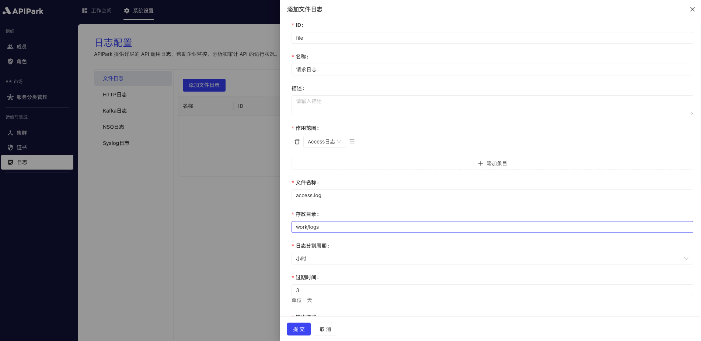
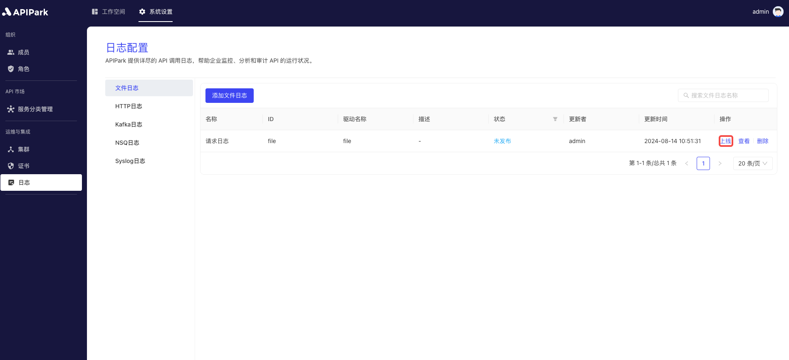

# File Logging

Collect log information of the request gateway and output it to a file for developers to query.

## Features

File Logging: Outputs request information to a log file with the following features:

* Customize the directory and filename for storing files
* Split log files according to a certain cycle to avoid the problem of a single file being too large to view
* Regularly delete expired files to reduce hard disk space expenses

## Operation Demonstration

### Create New File Logging Configuration

1. Click on `System Settings` -> `Operations and Integration` -> `Logs` -> `File Logging` in the left navigation bar, and then click `Add File Logging`.

  

2. Fill in the file logging configuration.

  

**Configuration Explanation**:

| Field Name     | Description                                                    |
| -------------- | -------------------------------------------------------------- |
| File Name      | Stored file name; the actual stored name will have a `.log` suffix, i.e., \{file name\}.log |
| Directory      | File storage directory; supports relative and absolute paths   |
| Log Split Cycle| Create new log files according to a certain cycle; old files will be renamed. Options: Hour, Day |
| Expiry Time    | File retention time, in days. Files exceeding the retention time will be regularly cleaned and deleted |
| Output Format  | Log content output format, supports single-line and JSON format output |
| Formatting Configuration | Output format template. Configuration tutorial [click here](https://help.apinto.com/docs/formatter) to jump |

**File Lifecycle Demonstration**


**Formatting Configuration Example**

```json
{
   "fields": [
      "$time_iso8601",
      "$request_id",
      "@request",
      "@proxy",
      "@response",
      "@status_code",
      "@time"
   ],
   "request": [
      "$request_method",
      "$scheme",
      "$request_uri",
      "$host",
      "$header",
      "$remote_addr"
   ],
   "proxy": [
      "$proxy_method",
      "$proxy_scheme",
      "$proxy_uri",
      "$proxy_host",
      "$proxy_header",
      "$proxy_addr"
   ],
   "response": [
      "$response_header"
   ],
   "status_code": [
      "$status",
      "$proxy_status"
   ],
   "time": [
      "$request_time",
      "$response_time"
   ]
}
```

After completing, click `Submit`.

### Go Live

1. Click the `Go Live` button next to the configuration waiting to be launched.

  

### Access Interface, Print Log Output

> **Prerequisite:**
>
> 1. You have completed the service subscription process, and the service provider has approved the subscription application. If not, refer to the tutorial [Subscribe Service](../../../quick/suberscriber/subscribe.md).

Access the subscribed interface. Here we use the `Apikit` test function for demonstration.


After accessing, enter the node directory to view the access log output information, as shown below.

