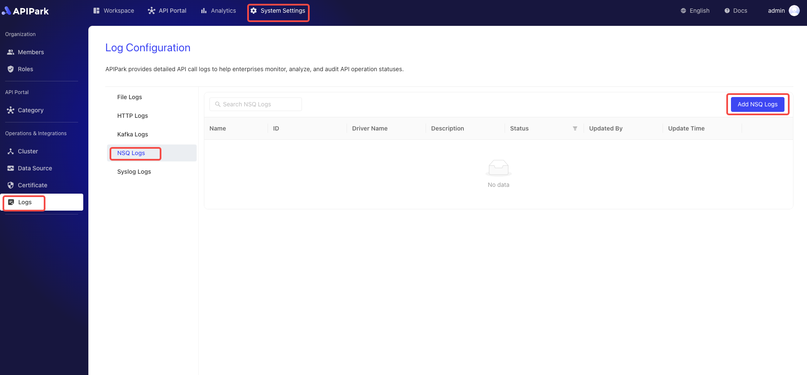

# NSQ Log

## Introduction

Collect log information from the request gateway and output it to `NSQ`, making it convenient for users to perform secondary operations such as log analysis.

## Features

Allows the log content generated during the program execution to be output to a specified `NSQ` Topic.

* Supports multiple `NSQD` request addresses
* Supports different log output formats
* Allows custom log formatting configuration

## Operation Demo

### Create NSQ Log Configuration

1. Click on `Operations & Integration` -> `Log Configuration` -> `NSQ Log` in the left navigation bar, and click `Add NSQ Log`.

  

2. Fill in the NSQ log configuration.

  


**Configuration Explanation**:

| Field Name      | Description                                                 |
| --------------- | ----------------------------------------------------------- |
| NSQD Address List | List of TCP service addresses provided by NSQD, supporting multiple addresses |
| Topic           | Topic information of NSQD                                    |
| Authentication Secret | Authentication key information for accessing NSQD         |
| Output Format   | Format of the output log content, supporting single line and JSON formats |
| Format Configuration | Output format template. For the configuration guide, [click here](https://help.apinto.com/docs/formatter) to navigate |

**Sample Format Configuration**

```json
{
   "fields": [
      "$time_iso8601",
      "$request_id",
      "@request",
      "@proxy",
      "@response",
      "@status_code",
      "@time"
   ],
   "request": [
      "$request_method",
      "$scheme",
      "$request_uri",
      "$host",
      "$header",
      "$remote_addr"
   ],
   "proxy": [
      "$proxy_method",
      "$proxy_scheme",
      "$proxy_uri",
      "$proxy_host",
      "$proxy_header",
      "$proxy_addr"
   ],
   "response": [
      "$response_header"
   ],
   "status_code": [
      "$status",
      "$proxy_status"
   ],
   "time": [
      "$request_time",
      "$response_time"
   ]
}
```


### Go Live

1. Click the `Go Live` button next to the configuration to be launched.

  

