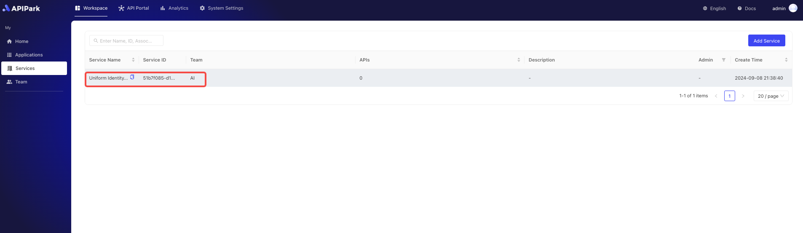
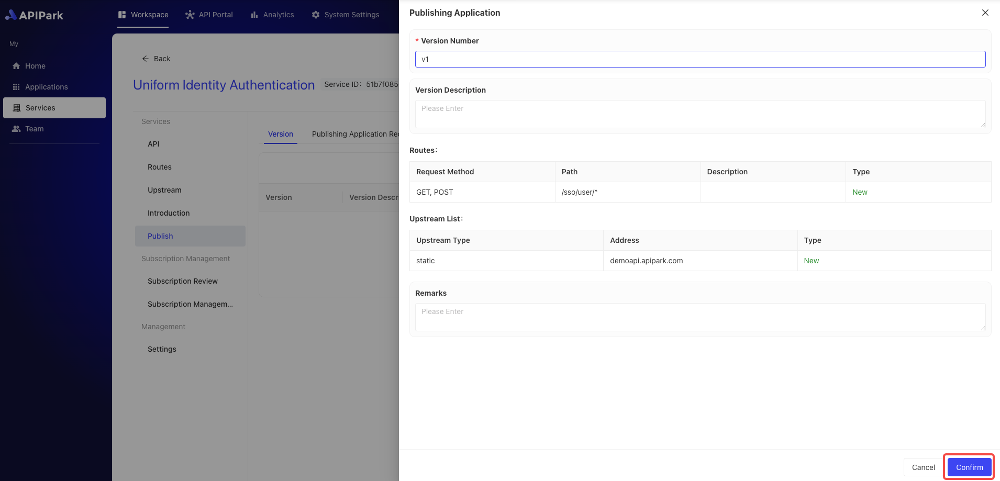
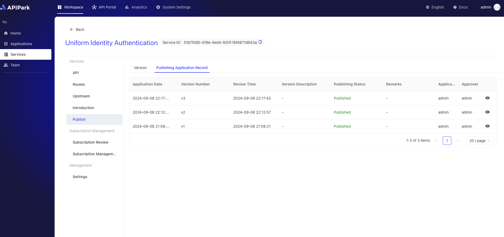
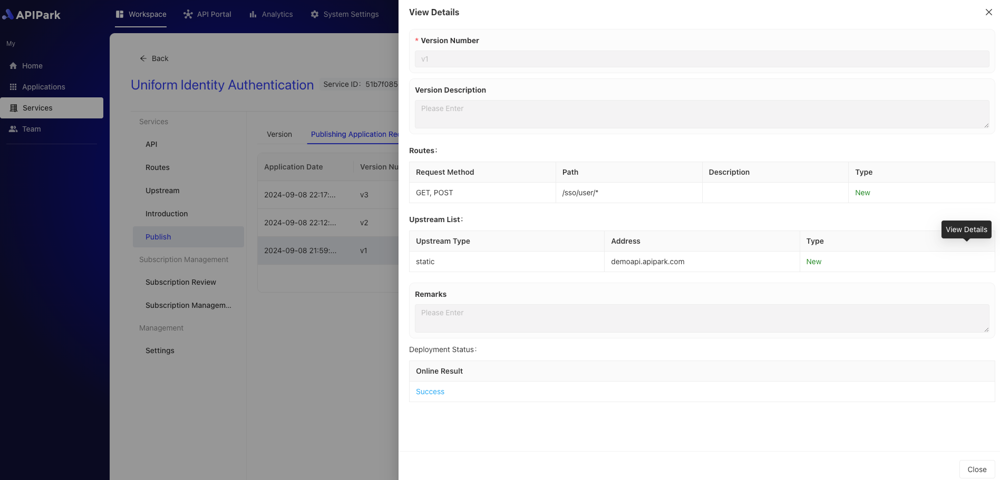

# Release

Releasing a service version is a crucial step in deploying the latest configured services and APIs to a production environment, ensuring that subscribers can access the APIs of the latest released version when invoked. By releasing a service version, you can manage the lifecycle of APIs and services uniformly, ensuring that the latest configurations of services and APIs take effect in a timely manner, maintaining the stability and reliability of the system.

After executing the release operation, if the current service is an `external service`, it will be displayed in the service plaza.

## Operation Demo
### Release Version

1. Select the service you want to configure and enter the internal page of the service.

2. Click `Publish` and then Click`New Version`.

  

3. Enter the version description information in the pop-up box, and after completing it, click `Confirm`.

   

After the release is complete, if the service is an external service, it will be displayed in the service plaza for subscribers to subscribe.

### View Release Records

1. Click `Publishing Application Record`  to enter the record list page.

  

2. Click the `View Details` button next to the record.

  

  
 