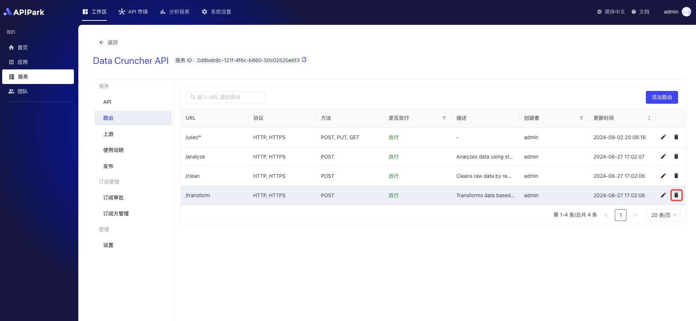

# Routing

Routing refers to the process by which an API Gateway forwards client requests to the appropriate backend service based on specific paths or conditions. An API Gateway is a middleware layer that sits between clients and servers, used for managing, monitoring, and routing client API requests. Its routing functionality is one of the core features of an API Gateway.

In an API Gateway, routing is typically based on conditions such as URL paths, HTTP methods (e.g., GET, POST), request headers, query parameters, and more. When the API Gateway receives a client request, it decides which backend service to forward the request to based on pre-configured routing rules.

## Operation Demonstration
### Adding a Route

1. Select the service you need to configure and enter the service page.

  

2. Click on "Routing"

3. Click on "Add Route"

4. Fill in the basic routing information

**Field Descriptions**

| Field Name        | Description                                                        |
| :---------------- | :----------------------------------------------------------------- |
| Intercept Request | Whether to intercept the request to this interface                 |
| Request Method    | Supports common HTTP request methods like GET, POST, PUT, DELETE, etc., and supports multiple selections |
| Request Path      | The URI of the API used for the relative path in the request URL; supports Restful parameters and path prefix matching |
| Advanced Matching | Supports matching via request headers, request parameters, and Cookies; multiple entries can be added |
| Forwarding Upstream Path | The relative path forwarded to the upstream service            |
| Request Timeout   | Defines the timeout period for the gateway to forward a request to the upstream to receive a response |
| Retry Count       | The gateway will automatically retry forwarding the request when a failure occurs; the maximum retry count does not exceed the configured limit |
| Forwarding Upstream Headers | Allows new, edit, and delete operations on forwarding upstream headers, primarily used in authentication between the gateway and upstream |

Once completed, click the "Submit" button.

This guide covers all steps for configuring routes in the application, including selecting routing options, adding routes, choosing request methods, configuring API basic information, and finally submitting the configuration.

### Editing a Route

1. Click the `Edit` button next to the route you want to edit.

  

2. Fill in the route information.

  

After filling, click submit.

### Deleting a Route
1. Click the `Delete` button next to the route you want to delete.

  

2. In the pop-up window, click confirm.

  

### Deleting an API
1. Click the `Delete` button next to the API you want to delete.

  

2. In the pop-up window, click `Confirm`.

  