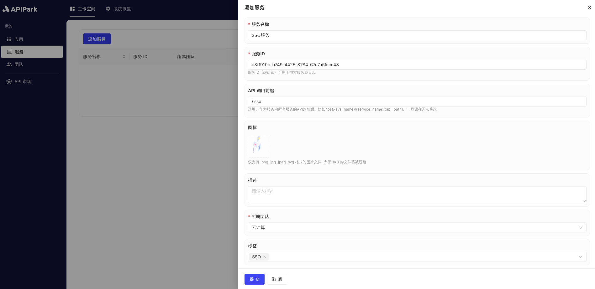
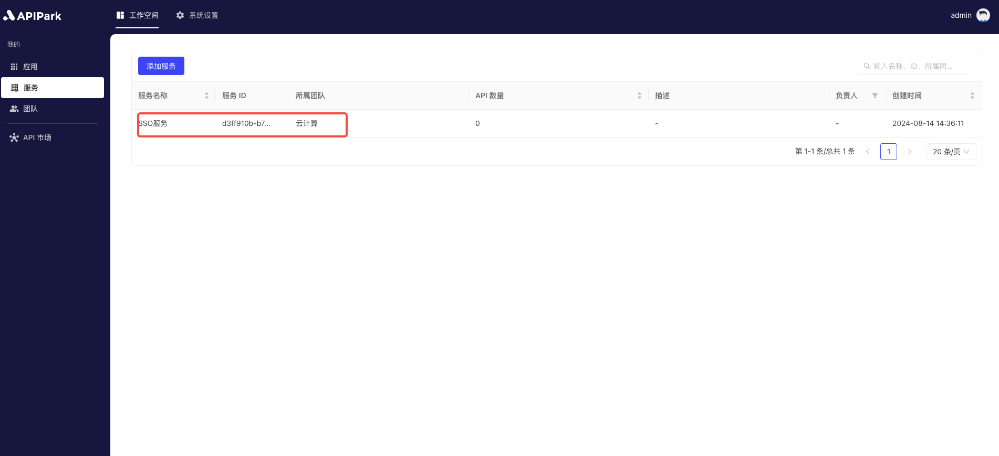
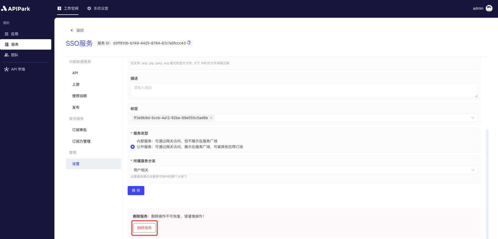

# Service Management

The Service Management module allows teams to create and manage multiple services, each of which can be linked to multiple APIs. Users can display services in the Service Square for subscribers to subscribe to as needed. Subscription requests require administrator approval, and once approved, subscribers can access all APIs under that service. This module enables teams to effectively manage and publish APIs, while subscribers can easily obtain the required services, enhancing API usage efficiency and team collaboration capabilities.

:::tip
Services displayed in the Service Square must meet the following criteria:

* The service type is **External Service**;
* The service has an **API**, if not, please refer to the tutorial [Add API](api.md#添加api);
* The service has a configured `Upstream`, if not configured, please refer to the tutorial [Configure Upstream](upstream.md#配置上游);
* The service has been **Published**, if not, please refer to the tutorial [Release Version](release.md#发布版本).
:::

## Operation Demonstration
### Add Service
1. Click `Workspace` -> `Mine` -> `Services` to enter the service list page, then click `Add Service`.

  

2. Fill in the service information in the popup box.

  

  

**Field Descriptions**

<table><thead><tr><th width="169">Field Name</th><th>Description</th></tr></thead><tbody><tr><td>Service Name</td><td>Name used to identify and describe the service.</td></tr><tr><td>Service ID</td><td>The service ID is used to uniquely identify the service, ensuring that different services can be accurately distinguished during management and operations. The service ID is used internally and during calls and is not easily changed.</td></tr><tr><td>API Call Prefix</td><td>Refers to the URL prefix used when calling the service's API. It is used for unified management and routing of API requests to ensure requests can be correctly directed to the target service. The prefix should be related to the service name and easy to remember and use.</td></tr><tr><td>Description</td><td>Records and displays detailed information and functionality descriptions of the service.</td></tr><tr><td>Team</td><td>The team responsible for managing and maintaining the service.</td></tr><tr><td>Icon</td><td>This icon will be displayed in the Service Square.</td></tr><tr><td>Tags</td><td>Custom tags for the service to facilitate easy searching by subscribers.</td></tr><tr><td>Service Type</td><td>If it is an external service, subscribers can apply to subscribe in the Service Square, and once approved by the provider, can initiate calls. If it is an internal service, call permissions can only be distributed through provider allocation to subscribers.</td></tr></tbody></table>

After completing the information, click `Submit`.

### Edit Service Information
1. Select the service you want to edit and click to enter the service details page.

  

2. Click `Settings` to enter the service settings page.

  

3. After making changes, click `Save`.

  

### Edit Service Instructions
:::tip
If the service is an external service and has been published, the service instructions will be displayed in the API market's service details and updated in real-time.
:::
1. Click `Usage Instructions`.

  

After editing, click save.

### Delete Service

1. After entering the service settings page, click `Delete Service` at the bottom.

  

2. In the popup box, click `Confirm`.

  