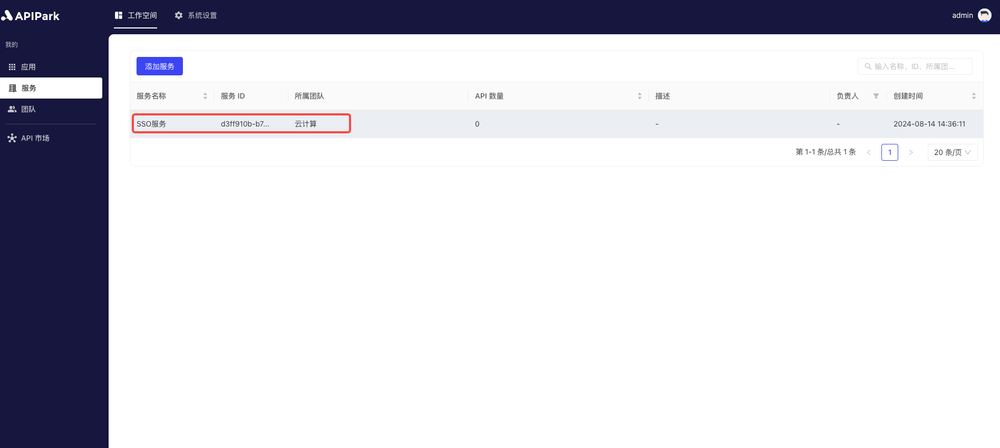
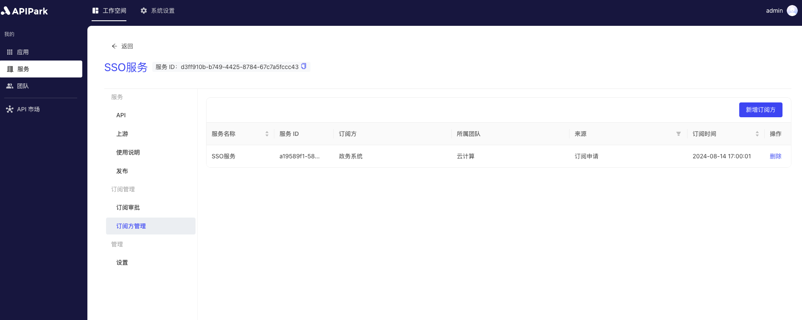

# Subscriber Management

Subscriber management is designed to help platform administrators effectively manage and control the users of APIs and their access permissions. Through subscriber management, developers and administrators can clearly understand who is using the API, which APIs are being used, and how they are being used, thus ensuring the platform's security, controllability, and efficiency.

### **Main Features**

**Subscription Application and Approval**:

* **Application Process**: Subscribers (applications) can apply to subscribe to the required API services through the platform, providing necessary information and the purpose of use.
* **Approval Process**: Administrators can review subscription applications to ensure that only qualifying subscribers can access the API, guaranteeing the API's security.

**Add/Delete Subscribers**:

* **Create Subscriber**: Administrators can manually add new subscribers, specifying which APIs they can access and their permissions.
* **Revoke Permissions**: When a subscriber no longer needs to use the API, or if their behavior does not comply with usage regulations, administrators can revoke their access permissions.

### **Use Cases**

* **Enterprise Internal Management**: When multiple departments or teams within an enterprise use the API, subscriber management can effectively manage and control each department's or team's API usage.
* **Partner Management**: When an enterprise shares its APIs with multiple partners, subscriber management ensures that partners use the APIs compliantly and securely.

## Operational Demonstration

### Add Subscriber

1. Select the service that needs approval and enter the internal page of the service.

2. Click on `Subscriber Management`, enter the subscriber list, and click `Add Subscriber`.

  

3. In the pop-up dialog, select the `application` that needs to subscribe to the current service, and then click `Confirm`.

  

### Delete Subscriber

1. Click `Delete` behind the subscriber you wish to remove.

  

2. In the pop-up dialog, click `Confirm`.

  