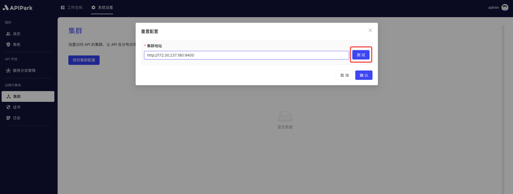

# Cluster Configuration

To ensure the platform can run stably, you need to properly configure the **APIPark Gateway** cluster environment and set up the cluster's communication address on the platform.

## Operation Demonstration

:::tip
Before configuration, make sure you have available APIPark gateway nodes.
:::

1. Click `System Configuration` -> `Operations & Integration` -> `Cluster`, then click `Modify Cluster Configuration`.

  

2. Enter the cluster node's Admin address in the pop-up box.

:::tip
If you use the one-click deployment script to deploy APIPark gateway nodes, the Admin communication address of the nodes will be displayed once deployment completes.

  
:::

3. After filling it out, click Test.

  

4. Once the test is passed, click Confirm.

  