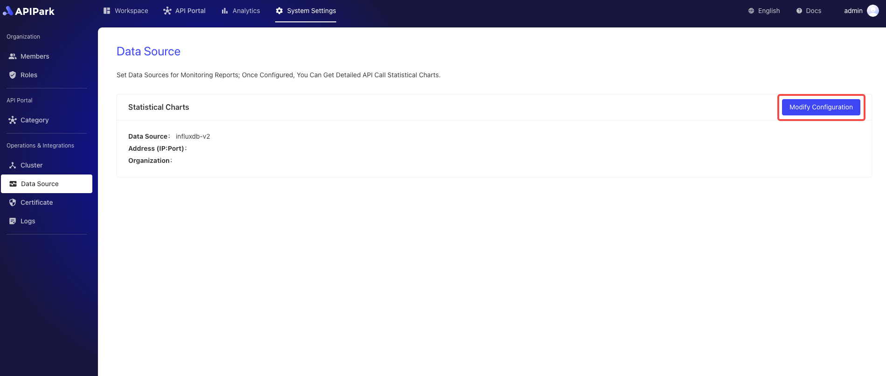
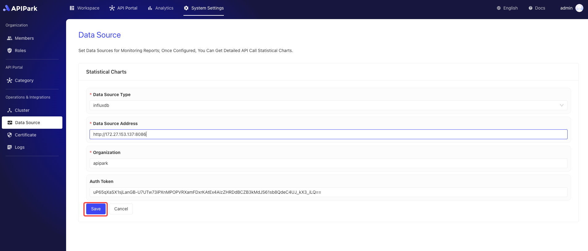

# Configuration Monitoring

## Operation Demonstration
:::tip
Before configuring, you need to have InfluxDB installed and configured. If you haven't, please refer to the guide [Configuring InfluxDB](../../install.md#configuring-influxdb).
:::

1. Click `System Settings` -> `Operations & Integrations` -> `Data Source` to enter the monitoring configuration interface, then click `Modify Configuration`.

  

2. Enter the InfluxDB configuration information. After filling it out, click `Save`.

  

## Running View
:::tip
After configuring monitoring, we can view the API's operational status on the dashboard. The dashboard provides various statistical charts to help us understand the API's performance.
:::

