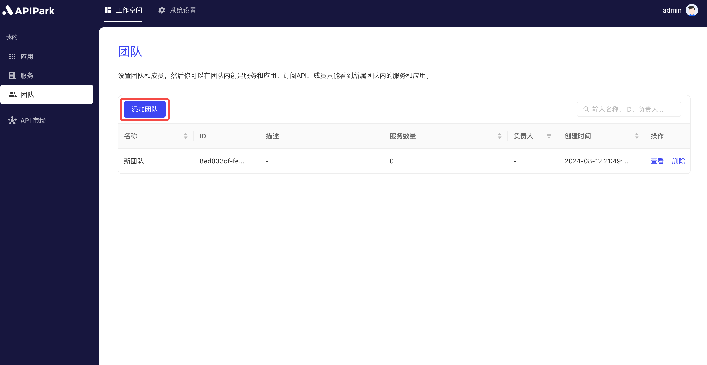

# Add Team

**APIPark** manages permissions and multi-tenancy by teams. Through the team module, enterprises can assemble different teams based on project needs, with each team independently managing its API services.

## Operation Demo

1. Click `Workspace` -> `My` -> `Team` to enter the team list page.

  

2. Click the `Add Team` button.

  

3. Enter team information in the pop-up box and click `Confirm` after completing it.

  

**Field Descriptions**

<table><thead><tr><th width="203">Field Name</th><th>Description</th></tr></thead><tbody><tr><td>Team Name</td><td>Identifier used to distinguish different teams. The team name should be concise and clearly reflect the team's responsibilities and tasks.</td></tr><tr><td>Team ID</td><td>Unique identifier for the team, customizable.</td></tr><tr><td>Team Leader</td><td>Assign a team leader. After creating the team, this leader will receive the team administrator role.</td></tr><tr><td>Description</td><td>For recording and displaying detailed information and notes related to a specific team.</td></tr></tbody></table>
