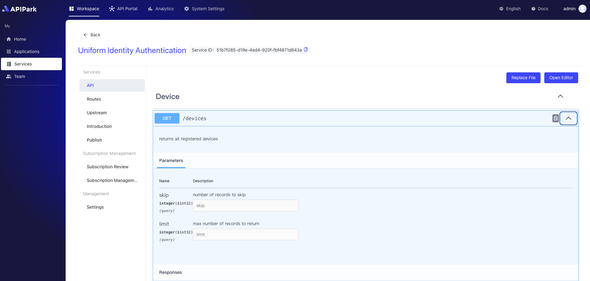
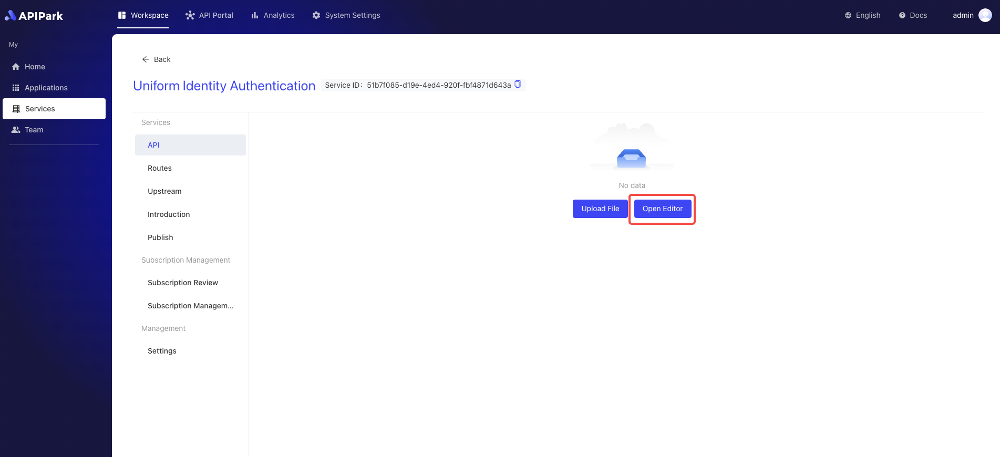
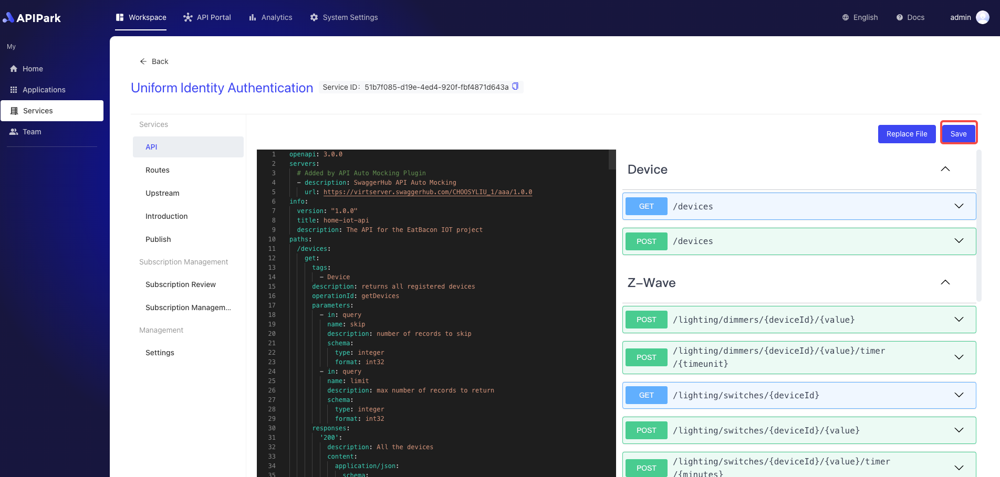

# Configure API (OpenAPI)

**OpenAPI** is a widely used specification for describing and documenting RESTful APIs. Initially known as **Swagger**, the OpenAPI Specification (OAS) provides a structured way to define an API's interface, including its endpoints, operations, requests, responses, and other related metadata. OpenAPI aims to simplify and standardize the design, development, documentation generation, and testing of APIs.

**APIPark** supports OpenAPI V2.0 and V3.0 formats, and you can upload an OpenAPI YAML file to create API documentation.

The API documentation configured within the service will be displayed in the service plaza upon publication, as shown in the image below:

  

## Steps 

1. Select the service that needs to be configured and enter the service's detail page.

  

2. Click on `API` to enter the API page.

  

3. Click `Open Editor`.

  
 

4. Write the OpenAPI document in the editor.

  

After writing, click Save.

